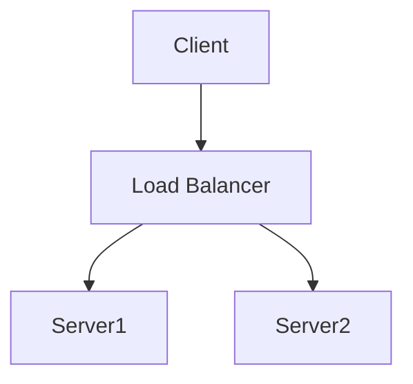

# Lang Assist Documentation

Lang Assist platformunun resmi dokümantasyonu.

## İçerik

- `/public`: Genel dokümantasyon
  - API Referansı
  - Kullanım Kılavuzları
  - Geliştirici Dokümantasyonu
  - Deployment Kılavuzları
  - Mimari Diyagramlar

## Teknolojiler

- Markdown
- Mermaid (Diyagramlar için)
- Draw.io (Mimari şemalar için)

## Dokümantasyon Yazma

1. Repository'yi klonlayın:

```bash
git clone https://github.com/lang-assist/docs.git
```

2. İlgili dizinde Markdown dosyanızı oluşturun
3. Diyagramlar için Mermaid syntax'ını kullanın:



4. Karmaşık mimari şemalar için Draw.io kullanın ve `.svg` olarak export edin

## Dokümantasyonu Görüntüleme

Dokümantasyonu yerel ortamda görüntülemek için:

```bash
npm install
npm run dev
```

## Katkıda Bulunma

1. Yeni bir branch oluşturun
2. Değişikliklerinizi yapın
3. Yazım ve format kontrolü yapın
4. Pull request oluşturun

## Stil Kılavuzu

- Başlıklar için ATX stili (`#`) kullanın
- Kod blokları için syntax highlighting kullanın
- Diyagramlar için mümkün olduğunda Mermaid tercih edin
- Karmaşık şemalar için Draw.io kullanın

## Lisans

Bu proje MIT lisansı altında lisanslanmıştır.
