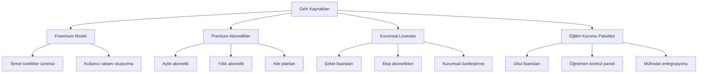
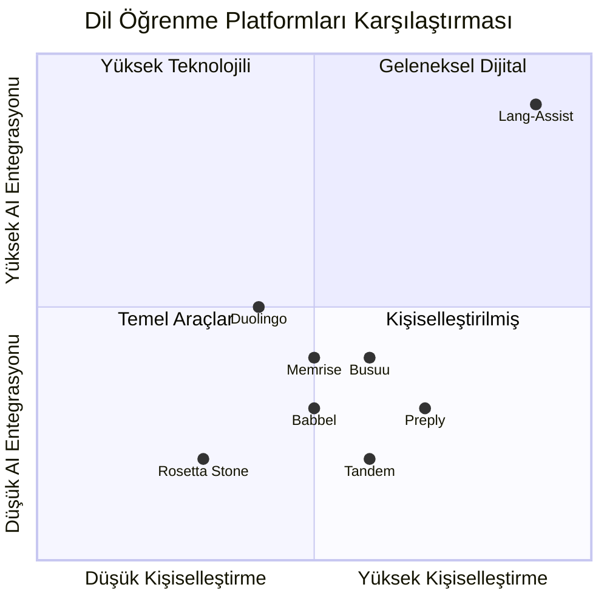

# Lang-Assist İş Modeli ve Değer Önerisi

## Genel Bakış

Lang-Assist, yapay zeka destekli kişiselleştirilmiş dil öğrenme deneyimini herkes için erişilebilir kılmayı hedefleyen yenilikçi bir platformdur. Gelişmiş AI modelleri kullanarak her kullanıcıya özel bir dil öğrenme yolculuğu sunar ve geleneksel dil öğrenme yöntemlerinin sınırlamalarını aşar.

## Değer Önerisi

### Kullanıcılar İçin Değer

```mermaid
graph TD
    A[Lang-Assist Değer Önerisi] --> B[Kişiselleştirilmiş Öğrenme]
    A --> C[Gerçek Dünya Pratiği]
    A --> D[Anlık Geri Bildirim]
    A --> E[Sürekli İlerleme Takibi]
    A --> F[Motivasyon Sistemleri]
    A --> G[Profesyonel Odaklı İçerik]

    B --> B1[Kullanıcı seviyesine uygun içerik]
    B --> B2[İlgi alanlarına göre materyaller]
    B --> B3[Zayıf noktalara odaklanan içerik]

    C --> C1[Simüle edilmiş konuşmalar]
    C --> C2[Gerçekçi senaryolar]
    C --> C3[Ses tabanlı etkileşim]

    D --> D1[Anında düzeltmeler]
    D --> D2[Detaylı açıklamalar]
    D --> D3[Öğrenme önerileri]

    E --> E1[Beceri bazlı ilerleme]
    E --> E2[Detaylı analitik]
    E --> E3[Öğrenme yolu optimizasyonu]

    F --> F1[Gamification elementleri]
    F --> F2[Başarı rozetleri]
    F --> F3[Topluluk özellikleri]

    G --> G1[Mesleğe özel terminoloji]
    G --> G2[Sektörel senaryolar]
    G --> G3[Branşlaşan öğrenme yolları]
```

1. **Kişiselleştirilmiş Öğrenme Deneyimi**

   - Her kullanıcının seviyesine, öğrenme hızına ve stiline uyarlanmış içerik
   - Kullanıcının ilgi alanlarına ve mesleğine göre özelleştirilmiş materyaller
   - Güçlü ve zayıf yönlere göre dinamik olarak ayarlanan öğrenme yolu

2. **Gerçek Dünya Dil Pratiği**

   - AI destekli karakterlerle gerçekçi konuşma senaryoları
   - Günlük hayatta ve profesyonel ortamlarda kullanılabilecek pratik dil becerileri
   - Ses tanıma ve telaffuz değerlendirme ile konuşma pratiği

3. **Anlık ve Detaylı Geri Bildirim**

   - Her etkileşimde anında düzeltme ve öneriler
   - Hataların neden yapıldığına dair açıklamalar
   - Kişiselleştirilmiş öğrenme ipuçları

4. **Branşlaşan Öğrenme Yolları**

   - B1 seviyesinden sonra profesyonel alanlara özel içerik
   - Mesleğe özel terminoloji ve senaryolar
   - Çoklu dal takibi ve koordinasyonu

5. **Motivasyon ve Süreklilik**
   - Gamification elementleri ile öğrenme motivasyonunu artırma
   - Kullanıcının rutinine uygun öğrenme hatırlatıcıları
   - Topluluk özellikleri ve sosyal öğrenme fırsatları

### Kurumlar İçin Değer

1. **Eğitim Kurumları**

   - Öğrencilerin dil becerilerini hızla geliştirme
   - Öğretmenlere yardımcı AI asistan
   - Detaylı ilerleme raporları ve analitik

2. **Şirketler**

   - Çalışanların dil becerilerini geliştirme
   - Sektöre özel dil eğitimi
   - Ekip bazlı ilerleme takibi

3. **Dil Okulları**
   - Geleneksel eğitimi tamamlayıcı dijital çözüm
   - Öğrenci başarısını artırma
   - Kişiselleştirilmiş ödev ve pratik imkanı

## İş Modeli

### Gelir Kaynakları

1. **Freemium Model**

   - Temel özellikler ücretsiz olarak sunulur
   - Kullanıcı tabanı oluşturma ve organik büyüme
   - Ücretsiz seviye için günlük/haftalık limitler

2. **Premium Bireysel Abonelikler**

   - Aylık abonelik: 9.99$ - 14.99$
   - Yıllık abonelik: 89.99$ - 129.99$ (2 ay bedava)
   - Aile planı: 19.99$ - 24.99$/ay (5 kullanıcıya kadar)

3. **Kurumsal Lisanslar**

   - Şirketler için kullanıcı başına ölçeklenen fiyatlandırma
   - Özel kurumsal özellikler ve raporlama
   - Kurumsal SSO ve yönetim paneli

4. **Eğitim Kurumu Paketleri**
   - Okullar ve üniversiteler için özel fiyatlandırma
   - Öğretmen kontrol paneli ve sınıf yönetimi
   - Müfredat entegrasyonu ve özelleştirme

### Premium Özellikler

1. **İleri Seviye AI Asistan**

   - Sınırsız konuşma pratiği
   - Detaylı telaffuz analizi
   - Profesyonel yazı düzeltme
   - Kişisel öğrenme koçu

2. **Özelleştirilmiş İçerik**

   - Meslek ve sektöre özel içerikler
   - Sınav hazırlık programları (TOEFL, IELTS, vb.)
   - Akademik dil hazırlık materyalleri

3. **Gelişmiş Analiz**

   - Detaylı ilerleme raporları
   - Öğrenme stili analizi
   - Performans tahminleri
   - Dal bazlı performans analizi

4. **Offline Özellikler**
   - İçerik indirme
   - Çevrimdışı pratik yapma
   - Senkronizasyon

## Pazar Analizi

### Hedef Kitle

1. **Birincil Hedef Kitle**

   - 18-35 yaş arası yetişkinler
   - Dil öğrenmeye istekli ancak geleneksel yöntemlerden sıkılmış
   - Teknoloji meraklısı
   - Esnek zamanlı öğrenme ihtiyacı olanlar
   - Profesyonel gelişim için dil öğrenenler

2. **İkincil Hedef Kitle**
   - Öğrenciler (15-18 yaş)
   - Profesyoneller (35-50 yaş)
   - Dil öğretmenleri (asistan olarak kullanım)
   - Yurtdışı eğitim/iş için hazırlananlar

### Pazar Büyüklüğü ve Büyüme

- Global dil öğrenme pazarı 2023'te yaklaşık 60 milyar dolar değerinde
- 2030'a kadar yıllık %10+ büyüme beklentisi
- Dijital dil öğrenme segmenti en hızlı büyüyen alan
- AI destekli dil öğrenme çözümleri için artan talep

### Rekabet Analizi

1. **Rekabet Avantajları**

   - Yüksek düzeyde kişiselleştirilmiş içerik
   - Gelişmiş AI konuşma pratiği
   - Profesyonel alanlara özel branşlaşan öğrenme yolları
   - Kapsamlı ilerleme analizi ve geri bildirim
   - Çok modlu öğrenme (metin, ses, görsel)

2. **Rekabet Dezavantajları**
   - Yeni oyuncu olarak marka bilinirliği düşük
   - Başlangıçta içerik kütüphanesi sınırlı
   - Yüksek AI maliyetleri

## Büyüme Stratejisi

### Kısa Vadeli (1-2 Yıl)

1. **Ürün Geliştirme**

   - Temel özelliklerin tamamlanması
   - Kullanıcı deneyiminin optimize edilmesi
   - İlk dil çiftlerinin (İngilizce-Türkçe, İngilizce-İspanyolca) lansmanı

2. **Kullanıcı Edinme**

   - Freemium model ile geniş kullanıcı tabanı oluşturma
   - Hedefli dijital pazarlama kampanyaları
   - İçerik pazarlaması ve SEO stratejisi

3. **Gelir Artırma**
   - Premium dönüşüm oranını optimize etme
   - Kurumsal pilot programlar başlatma

### Orta Vadeli (3-5 Yıl)

1. **Ürün Genişletme**

   - Ek dil çiftleri ekleme
   - Daha fazla profesyonel alan için branşlaşan yollar
   - Mobil uygulama geliştirme

2. **Pazar Genişletme**

   - Uluslararası pazarlara açılma
   - Eğitim kurumları ile stratejik ortaklıklar
   - Kurumsal müşteri tabanını genişletme

3. **Teknoloji Geliştirme**
   - AI modellerini iyileştirme
   - Daha gelişmiş kişiselleştirme algoritmaları
   - Yeni öğrenme modaliteleri ekleme

## Finansal Projeksiyonlar

### Gelir Projeksiyonu (5 Yıllık)

| Yıl | Kullanıcı Sayısı | Premium Dönüşüm | Yıllık Gelir |
| --- | ---------------- | --------------- | ------------ |
| 1   | 100,000          | %5              | $600,000     |
| 2   | 500,000          | %8              | $4,800,000   |
| 3   | 1,500,000        | %10             | $18,000,000  |
| 4   | 3,000,000        | %12             | $43,200,000  |
| 5   | 5,000,000        | %15             | $90,000,000  |

### Maliyet Yapısı

1. **Sabit Maliyetler**

   - Geliştirme ekibi
   - Sunucu altyapısı
   - Ofis ve yönetim

2. **Değişken Maliyetler**

   - AI işlem maliyetleri
   - Kullanıcı edinme
   - İçerik üretimi

3. **Ölçeklendirme Stratejisi**
   - AI işlem maliyetlerini optimize etme
   - Kullanıcı edinme maliyetlerini düşürme
   - Operasyonel verimliliği artırma

## Sonuç

Lang-Assist, yapay zeka teknolojisinin gücünü kullanarak dil öğrenme deneyimini kökten değiştirmeyi hedeflemektedir. Kişiselleştirilmiş, etkileşimli ve gerçek dünya odaklı yaklaşımıyla, kullanıcıların dil becerilerini daha hızlı ve etkili bir şekilde geliştirmelerini sağlar. Freemium iş modeli ve çeşitli gelir kaynaklarıyla, sürdürülebilir büyüme ve uzun vadeli başarı için sağlam bir temel oluşturmaktadır.
