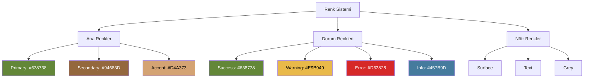
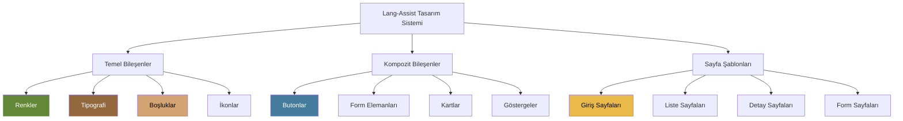

# Lang-Assist Design System

Bu doküman, Lang-Assist uygulamalarının tasarım sistemini özetler. Detaylı bilgi için [Flutter Styling Guide](./flutter_styling_guide.md) ve [Flutter Design Guide](./flutter_design_guide.md) dokümanlarına bakabilirsiniz.

## Genel Bakış

Lang-Assist tasarım sistemi, tutarlı ve kullanıcı dostu bir deneyim sağlamak için tasarlanmış kapsamlı bir bileşen ve stil kütüphanesidir. Bu sistem, hem açık hem de koyu tema desteği sunar ve tüm platformlarda tutarlı bir görünüm sağlar.

## Tasarım Prensipleri

1. **Tutarlılık**: Tüm platformlarda ve uygulamalarda tutarlı bir kullanıcı deneyimi
2. **Erişilebilirlik**: Tüm kullanıcılar için erişilebilir arayüzler
3. **Sadelik**: Kullanıcıların kolayca anlayabileceği basit ve sezgisel arayüzler
4. **Hiyerarşi**: Görsel hiyerarşi ile kullanıcıları yönlendirme
5. **Geri Bildirim**: Kullanıcı etkileşimlerine anlamlı geri bildirimler

## Renk Sistemi

Lang-Assist, doğadan ilham alan bir renk paletine sahiptir:



## Tipografi

Nunito font ailesini kullanan, okunabilir ve tutarlı bir tipografi sistemi:

| Stil     | Boyut   | Kullanım Alanları                  |
| -------- | ------- | ---------------------------------- |
| Display  | 32-48px | Büyük başlıklar, hero alanları     |
| Headline | 20-28px | Sayfa başlıkları, bölüm başlıkları |
| Title    | 16-20px | Kart başlıkları, alt başlıklar     |
| Body     | 12-16px | Ana içerik metni                   |
| Label    | 12-16px | Butonlar, etiketler                |

## Boşluk ve Ölçüler

Tutarlı bir arayüz için standartlaştırılmış değerler:

| Değer | Boyut | Kullanım Alanları   |
| ----- | ----- | ------------------- |
| xxs   | 2.0   | Minimum ayrım       |
| xs    | 4.0   | İkon içi boşluklar  |
| sm    | 8.0   | Küçük boşluklar     |
| md    | 16.0  | Standart boşluklar  |
| lg    | 24.0  | Bölüm araları       |
| xl    | 32.0  | Büyük bölüm araları |
| xxl   | 40.0  | Maksimum boşluklar  |

## Temel Bileşenler

### Scaffold Yapıları

- **AppScaffold**: Ana uygulama sayfaları için
- **UserScaffold**: Mobil uygulamada kullanıcı arayüzü için (kullanıcı avatarı, navigasyon menüsü ve profil yönetimi içerir)
- **AuthScaffold**: Kimlik doğrulama sayfaları için
- **AppTabView**: Sekmeli içerik için
- **BrocaBackground**: Özel arka plan deseni

### Butonlar

- **AppButton**: Çeşitli varyantlar (primary, secondary, outlined, text, danger, highlighted, icon)
- **Boyutlar**: small, medium, large

### Form Elemanları

- **AppFormField**: Metin girişi, şifre, sayı vb.
- **AppCheckbox**: Onay kutuları
- **AppRadio**: Radyo butonları
- **AppSelectCard**: Seçim kartları

### Kartlar

- **AppCard**: İçerik gruplamak için
- **ChoiceCard**: Seçim yapılabilir kartlar

### Diğer Bileşenler

- **AIIndicator**: AI işlemlerinin durumunu göstermek için
- **Avatar**: Kullanıcı avatarları

## Sayfa Şablonları

- **Giriş/Kayıt Sayfaları**: Kimlik doğrulama için
- **Liste Sayfaları**: Veri listelerini göstermek için
- **Detay Sayfaları**: Tek bir öğenin detaylarını göstermek için
- **Form Sayfaları**: Veri girişi için

## Bileşen Hiyerarşisi



## Kullanım Örnekleri

### Mobil Uygulama Scaffold Örneği

```dart
UserScaffold(
  title: 'Ana Sayfa',
  body: ListView(
    padding: EdgeInsets.all(AppSpacing.md),
    children: [
      Text('Hoş Geldiniz', style: typo.headlineMedium),
      SizedBox(height: AppSpacing.md),
      AppCard(
        title: Text('Yaklaşan Randevular', style: typo.titleMedium),
        subtitle: Text('Bugün 2 randevunuz var', style: typo.bodySmall),
        isInteractive: true,
        onTap: () {
          // Randevular sayfasına git
        },
      ),
    ],
  ),
)
```

### Buton Örneği

```dart
AppButton(
  title: 'Kaydet',
  variant: AppButtonVariant.primary,
  size: AppSizeVariant.medium,
  onPressed: () {},
)
```

### Kart Örneği

```dart
AppCard(
  title: Text('Kart Başlığı', style: typo.titleMedium),
  subtitle: Text('Alt başlık metni', style: typo.bodySmall),
  isInteractive: true,
  onTap: () {},
)
```

### Form Alanı Örneği

```dart
AppFormField(
  label: 'E-posta',
  placeholder: 'ornek@email.com',
  name: 'email',
)
```

## Tema Desteği

Lang-Assist, açık ve koyu tema desteği sunar. Tema, `ThemeProvider` sınıfı üzerinden yönetilir:

```dart
// Tema değiştirme
ThemeProvider.instance.setBrightness(Brightness.dark)
```

## Daha Fazla Bilgi

- [Flutter Styling Guide](./flutter_styling_guide.md): Renk, tipografi, boşluk ve diğer stil öğeleri hakkında detaylı bilgi
- [Flutter Design Guide](./flutter_design_guide.md): Bileşenler, sayfa şablonları ve tasarım prensipleri hakkında detaylı bilgi

---

Bu doküman, Lang-Assist tasarım sisteminin genel bir özetini sunar. Daha detaylı bilgi için ilgili dokümanlara başvurunuz.
