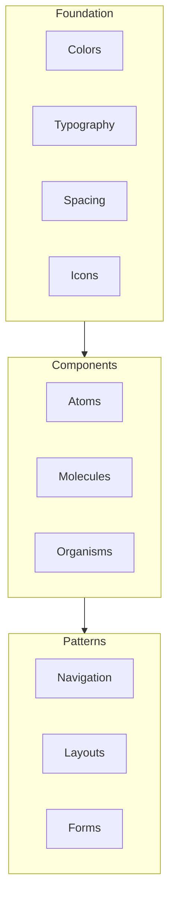

# Lang Assist Design Rules

## Core Principles

1. **Consistency First**

   - Use consistent design patterns across all platforms
   - Maintain visual hierarchy
   - Follow established component guidelines

2. **Accessibility**

   - Support different screen sizes
   - Implement proper contrast ratios
   - Enable screen reader support
   - Support different language directions (LTR/RTL)

3. **Performance**
   - Optimize asset sizes
   - Implement lazy loading
   - Use efficient animations
   - Cache appropriately

## Design System Structure



## Component Guidelines

### Atoms

1. **Buttons**

   - Primary: Main actions
   - Secondary: Alternative actions
   - Text: Subtle actions
   - Icon: Compact actions

2. **Input Fields**

   - Text inputs
   - Select inputs
   - Checkboxes
   - Radio buttons
   - Date pickers

3. **Typography**
   - Headings (H1-H6)
   - Body text
   - Captions
   - Links

### Molecules

1. **Form Groups**

   - Label + Input combinations
   - Error states
   - Helper text
   - Validation indicators

2. **Cards**

   - Content cards
   - Action cards
   - List items
   - Media cards

3. **Navigation Items**
   - Menu items
   - Tabs
   - Breadcrumbs
   - Pagination

### Organisms

1. **Forms**

   - Login forms
   - Registration forms
   - Search forms
   - Filter forms

2. **Lists**

   - Item lists
   - Grid layouts
   - Data tables
   - Feed layouts

3. **Navigation**
   - Header navigation
   - Sidebar navigation
   - Bottom navigation
   - Modal navigation

## Layout Guidelines

### Spacing System

```
4px - Extra small (xs)
8px - Small (sm)
16px - Medium (md)
24px - Large (lg)
32px - Extra large (xl)
48px - 2xl
64px - 3xl
```

### Breakpoints

```
xs: 0px
sm: 600px
md: 960px
lg: 1280px
xl: 1920px
```

### Grid System

- 12-column grid
- Responsive gutters
- Fluid margins
- Consistent padding

## Color System

### Primary Colors

```
primary-main: #2196F3
primary-light: #64B5F6
primary-dark: #1976D2
```

### Secondary Colors

```
secondary-main: #FF4081
secondary-light: #FF80AB
secondary-dark: #F50057
```

### Neutral Colors

```
grey-50: #FAFAFA
grey-100: #F5F5F5
grey-200: #EEEEEE
grey-300: #E0E0E0
grey-400: #BDBDBD
grey-500: #9E9E9E
grey-600: #757575
grey-700: #616161
grey-800: #424242
grey-900: #212121
```

## Typography

### Font Families

```
heading: 'Roboto'
body: 'Open Sans'
monospace: 'Roboto Mono'
```

### Font Sizes

```
h1: 96px
h2: 60px
h3: 48px
h4: 34px
h5: 24px
h6: 20px
body1: 16px
body2: 14px
caption: 12px
```

## Animation Guidelines

1. **Duration**

   - Extra short: 100ms
   - Short: 200ms
   - Medium: 300ms
   - Long: 400ms

2. **Easing**
   - Standard: cubic-bezier(0.4, 0.0, 0.2, 1)
   - Decelerate: cubic-bezier(0.0, 0.0, 0.2, 1)
   - Accelerate: cubic-bezier(0.4, 0.0, 1, 1)

## Asset Guidelines

1. **Icons**

   - SVG format
   - 24x24px grid
   - 2px stroke width
   - Rounded corners: 2px radius

2. **Images**
   - WebP format preferred
   - Fallback to JPEG/PNG
   - Responsive sizes
   - Lazy loading enabled

## Accessibility Standards

1. **Color Contrast**

   - AA standard minimum
   - 4.5:1 for normal text
   - 3:1 for large text

2. **Focus States**

   - Visible focus indicators
   - Keyboard navigation support
   - Skip navigation links

3. **Screen Readers**
   - Semantic HTML
   - ARIA labels
   - Alt text for images
   - Proper heading hierarchy

## Cross-Platform Considerations

1. **Mobile**

   - Touch targets: minimum 44x44px
   - Bottom navigation preferred
   - Pull-to-refresh patterns
   - Mobile-first approach

2. **Tablet**

   - Adaptive layouts
   - Split views where appropriate
   - Optimized touch targets
   - Landscape support

3. **Desktop**
   - Hover states
   - Keyboard shortcuts
   - Efficient navigation
   - Multi-column layouts

## Implementation Notes

1. **Flutter Widgets**

   - Use shared widget library
   - Follow naming conventions
   - Document customization options
   - Include usage examples

2. **Asset Management**

   - Central asset repository
   - Version control
   - Optimization pipeline
   - Distribution system

3. **Documentation**
   - Component API docs
   - Usage guidelines
   - Example implementations
   - Accessibility notes
