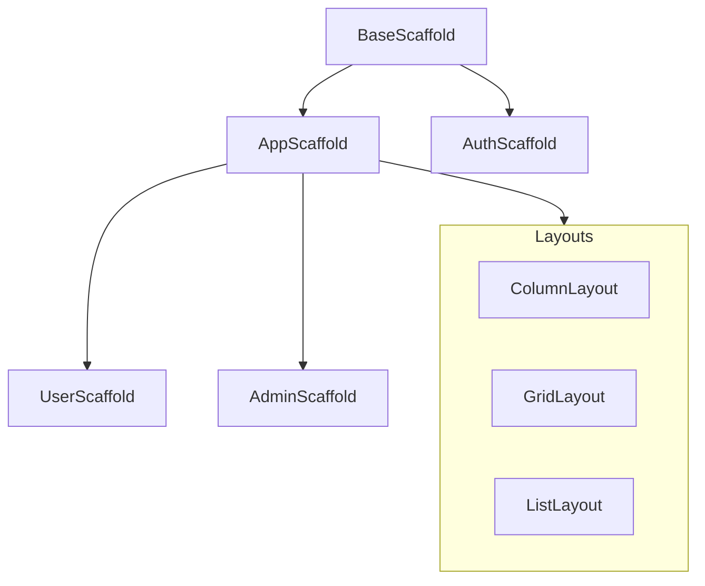
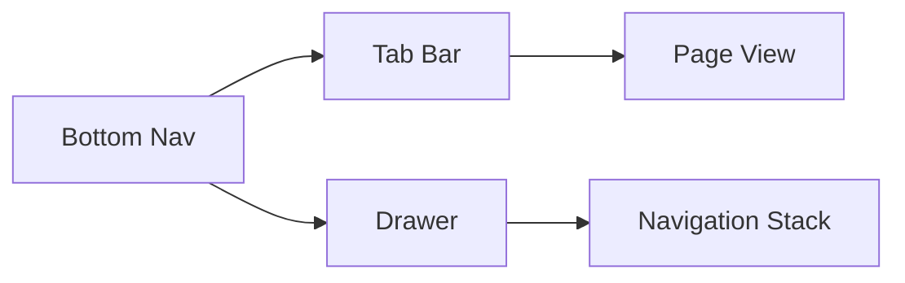
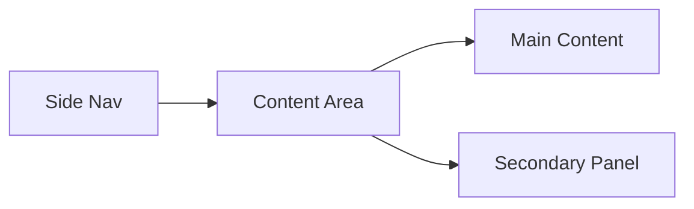

# Lang Assist Scaffold System

## Overview

Lang Assist'in yeni scaffold sistemi, modern ve modüler bir yaklaşımla tasarlanmıştır. Bu sistem, uygulamanın tüm ekranlarında tutarlı bir kullanıcı deneyimi sağlar.

## Core Principles

1. **Modülerlik**: Her scaffold bileşeni bağımsız ve yeniden kullanılabilir
2. **Tutarlılık**: Tüm platformlarda aynı görsel dil
3. **Esneklik**: Farklı kullanım senaryolarına uyarlanabilir yapı
4. **Performans**: Optimize edilmiş render ve animasyon sistemi

## Scaffold Hierarchy



## Component Structure

### 1. BaseScaffold

```dart
class BaseScaffold extends StatelessWidget {
  final Widget body;
  final PreferredSizeWidget? appBar;
  final Widget? bottomBar;
  final Widget? floatingAction;
  final EdgeInsets padding;
  final Color? backgroundColor;

  // Responsive configuration
  final bool maintainBottomViewPadding;
  final bool extendBody;
  final bool extendBodyBehindAppBar;
}
```

Temel özellikleri:

- Minimum gerekli yapı
- Platform-agnostik tasarım
- Basit ve anlaşılır API

### 2. AppScaffold

```dart
class AppScaffold extends StatelessWidget {
  final String title;
  final List<Widget> actions;
  final Widget body;
  final NavigationConfig navigation;
  final ThemeConfig theme;
  final ResponsiveConfig responsive;
}
```

Özelleştirmeler:

- Tema entegrasyonu
- Navigation yönetimi
- Responsive davranışlar

### 3. Specialized Scaffolds

```dart
class UserScaffold extends AppScaffold {
  final UserConfig user;
  final PermissionConfig permissions;
}

class AdminScaffold extends AppScaffold {
  final AdminConfig admin;
  final AnalyticsConfig analytics;
}
```

## Layout System

### 1. Grid Layout

```
|-------------|-------------|-------------|
|     Col     |     Col     |     Col     |
|-------------|-------------|-------------|
|           Gutter         Margin        |
```

Özellikler:

- 12 kolonlu grid sistemi
- Responsive gutter ve margin
- Breakpoint-based düzen

### 2. Spacing System

```
4px  - xxs (extra extra small)
8px  - xs  (extra small)
16px - sm  (small)
24px - md  (medium)
32px - lg  (large)
48px - xl  (extra large)
64px - xxl (extra extra large)
```

## Responsive Behavior

### 1. Breakpoints

```dart
enum Breakpoint {
  mobile,   // 0-599px
  tablet,   // 600-1023px
  desktop,  // 1024-1439px
  wide      // 1440px+
}
```

### 2. Layout Grids

```
Mobile:  4 columns, 16px gutter, 16px margin
Tablet:  8 columns, 24px gutter, 24px margin
Desktop: 12 columns, 24px gutter, 24px margin
Wide:    12 columns, 32px gutter, 32px margin
```

## Navigation Patterns

### 1. Mobile



### 2. Desktop



## Theme Integration

```dart
class ScaffoldTheme {
  final Color backgroundColor;
  final Color surfaceColor;
  final Color primaryColor;
  final double elevation;
  final BorderRadius borderRadius;
  final EdgeInsets padding;
}
```

## Usage Examples

### 1. Basic Usage

```dart
BaseScaffold(
  appBar: AppBar(title: Text('Home')),
  body: HomeContent(),
  padding: EdgeInsets.all(16),
)
```

### 2. Advanced Usage

```dart
AppScaffold(
  title: 'Dashboard',
  actions: [
    NotificationButton(),
    UserMenu(),
  ],
  navigation: NavigationConfig(
    type: NavigationType.sidebar,
    items: dashboardMenuItems,
  ),
  body: DashboardContent(),
  theme: ThemeConfig(
    mode: ThemeMode.system,
    customColors: brandColors,
  ),
)
```

## Best Practices

1. **Tutarlılık**

   - Her zaman en yakın scaffold tipini kullan
   - Özel durumlar için extend et, override etme
   - Theme sistemini kullan, hard-coded değerlerden kaçın

2. **Performans**

   - Gereksiz rebuild'lerden kaçın
   - Lazy loading kullan
   - Animasyonları optimize et

3. **Erişilebilirlik**

   - Semantic widget'lar kullan
   - Yeterli kontrast oranını sağla
   - Klavye navigasyonunu destekle

4. **Responsive Tasarım**
   - Mobile-first yaklaşım
   - Breakpoint'leri doğru kullan
   - Layout grid sistemine uy

## Migration Guide

1. Eski scaffold'dan yeni sisteme geçiş:

   ```dart
   // Eski
   Scaffold(
     appBar: AppBar(),
     body: Content(),
   )

   // Yeni
   BaseScaffold(
     appBar: AppHeader(),
     body: Content(),
   )
   ```

2. Theme entegrasyonu:

   ```dart
   // Eski
   Theme(
     data: ThemeData(),
     child: Scaffold()
   )

   // Yeni
   AppScaffold(
     theme: ThemeConfig(),
     body: Content()
   )
   ```
