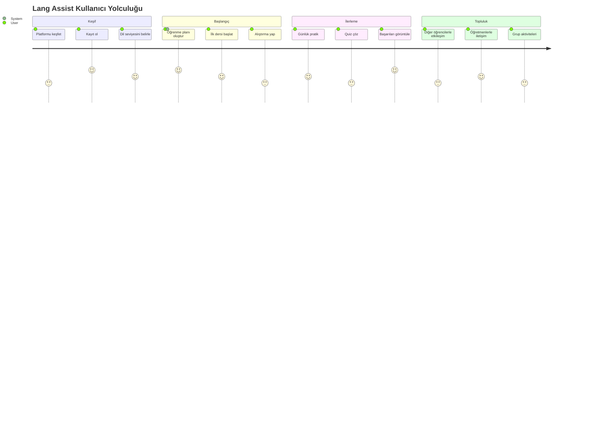
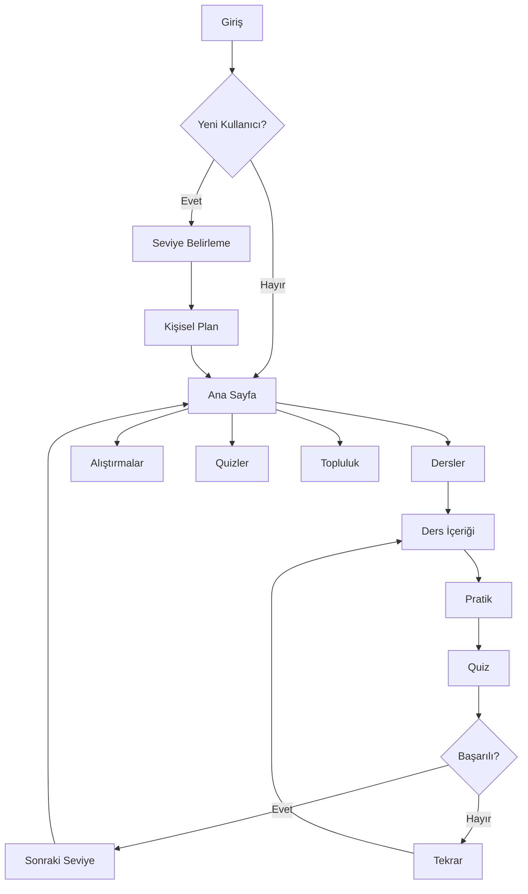
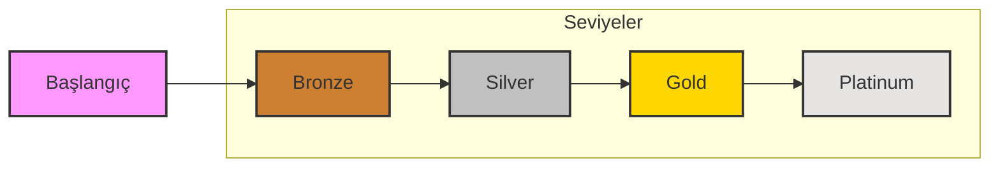

# User Journey & Path Architecture

## Overview

Lang Assist platformunda kullanıcı yolculuğu ve yol haritası, dil öğrenme deneyimini optimize etmek için tasarlanmıştır. Bu yapı, kullanıcıların öğrenme sürecini kişiselleştirilmiş ve etkili bir şekilde yönetmelerini sağlar.

## User Journey Map



## User Path Structure



## Path Components

### 1. Onboarding Path

- Kayıt/Giriş
- Dil seviyesi belirleme
- Hedef belirleme
- Öğrenme planı oluşturma

### 2. Learning Path

- Günlük dersler
- Pratik alıştırmalar
- İlerleme quizleri
- Başarı değerlendirmesi

### 3. Community Path

- Grup çalışmaları
- Öğretmen desteği
- Akran değerlendirmesi
- Sosyal etkileşim

## Progress Tracking



## Implementation Guidelines

### 1. Path Navigation

- Her seviye için net göstergeler
- İlerleme çubuğu
- Başarı rozetleri
- Seviye atlama kriterleri

### 2. Progress States

```typescript
enum ProgressState {
  NOT_STARTED = "not_started",
  IN_PROGRESS = "in_progress",
  COMPLETED = "completed",
  LOCKED = "locked",
}
```

### 3. Achievement System

```typescript
interface Achievement {
  id: string;
  title: string;
  description: string;
  points: number;
  requirements: Requirement[];
  rewards: Reward[];
}
```

### 4. Learning Path Structure

```typescript
interface LearningPath {
  id: string;
  level: LanguageLevel;
  modules: Module[];
  prerequisites: string[];
  estimatedDuration: Duration;
  skillsFocus: Skill[];
}
```

## UI Components

### 1. Progress Indicators

- Circular progress
- Linear progress bars
- Achievement badges
- Level indicators

### 2. Navigation Elements

- Path map
- Progress timeline
- Quick jump points
- Breadcrumb trail

### 3. Achievement Display

- Trophy case
- Progress statistics
- Leaderboard position
- Skill radar chart

## Gamification Elements

### 1. Point System

- Experience points (XP)
- Skill points
- Achievement points
- Community points

### 2. Rewards

- Level-up bonuses
- Achievement badges
- Special content unlock
- Community status

### 3. Challenges

- Daily challenges
- Weekly missions
- Monthly goals
- Special events

## Analytics Integration

### 1. Progress Metrics

- Completion rates
- Time spent
- Success rates
- Engagement levels

### 2. User Behavior

- Learning patterns
- Difficulty spots
- Preferred content
- Peak usage times

### 3. Performance Data

- Accuracy rates
- Speed metrics
- Retention scores
- Improvement trends

## Accessibility Considerations

### 1. Navigation

- Keyboard shortcuts
- Screen reader support
- Clear path indicators
- Alternative routes

### 2. Progress Visualization

- Color-blind friendly
- Multiple progress indicators
- Clear text descriptions
- Adaptive layouts

### 3. Achievement Recognition

- Multiple feedback types
- Customizable celebrations
- Inclusive messaging
- Varied reward types
