# Lang-Assist Flutter Design Guide

Bu doküman, Lang-Assist uygulamalarında kullanılan temel tasarım bileşenlerini ve sayfa yapılarını açıklar. Tüm Flutter geliştiricileri, tutarlı bir kullanıcı deneyimi sağlamak için bu kılavuzu takip etmelidir.

## İçindekiler

- [Scaffold Yapıları](#scaffold-yapıları)
  - [AppScaffold](#appscaffold)
  - [UserScaffold](#userscaffold)
  - [AuthScaffold](#authscaffold)
  - [AppTabView](#apptabview)
  - [BrocaBackground](#brocabackground)
- [Temel Bileşenler](#temel-bileşenler)
  - [Butonlar](#butonlar)
  - [Form Elemanları](#form-elemanları)
  - [Kartlar](#kartlar)
  - [Diğer Bileşenler](#diğer-bileşenler)
- [Tasarım Prensipleri](#tasarım-prensipleri)
- [Sayfa Şablonları](#sayfa-şablonları)
- [Bileşen Hiyerarşisi](#bileşen-hiyerarşisi)

## Scaffold Yapıları

Lang-Assist uygulamaları, farklı kullanım senaryoları için özelleştirilmiş scaffold yapıları kullanır. Bu yapılar, tutarlı bir sayfa düzeni ve navigasyon deneyimi sağlar.

### AppScaffold

`AppScaffold`, uygulamanın ana sayfa yapısıdır. Standart bir app bar, drawer menü ve içerik alanı içerir.

```dart
AppScaffold(
  title: 'Anasayfa',
  body: YourPageContent(),
  actions: [
    IconButton(
      icon: Icon(Icons.settings),
      onPressed: () {},
    ),
  ],
  onBackPressed: () => Navigator.pop(context),
  menuItems: [
    MenuItem(
      title: 'Profil',
      icon: Icons.person,
      onTap: () {},
      isSelected: () => false,
    ),
    MenuItem(
      title: 'Ayarlar',
      icon: Icons.settings,
      onTap: () {},
      isSelected: () => false,
    ),
  ],
)
```

**Kullanım Alanları:**

- Ana uygulama sayfaları
- Navigasyon gerektiren içerik sayfaları
- Drawer menü erişimi gereken sayfalar

### UserScaffold

`UserScaffold`, kullanıcı mobil uygulamasında kullanılan, kullanıcı arayüzü için özelleştirilmiş bir scaffold yapısıdır. `AppScaffold`'u temel alır ve kullanıcıya özel navigasyon ve profil yönetimi sağlar.

```dart
UserScaffold(
  title: 'Ana Sayfa',
  body: YourPageContent(),
  actions: [
    IconButton(
      icon: Icon(Icons.notifications),
      onPressed: () {},
    ),
  ],
  showBackButton: true,
  onBackPressed: () => Navigator.pop(context),
)
```

`UserScaffold`, otomatik olarak aşağıdaki özellikleri sağlar:

- Kullanıcı profil avatarı ve menüsü
- Önceden tanımlanmış navigasyon menü öğeleri (Ana Sayfa, Üyeler, Hizmetler, Randevular, Ayarlar)
- Akıllı rota yönetimi ve seçili menü öğesi vurgulama
- Kullanıcı çıkış işlevi

**Kullanım Alanları:**

- Mobil uygulama ana sayfaları
- Kullanıcı oturumu gerektiren sayfalar
- Standart navigasyon menüsü gerektiren sayfalar

### AuthScaffold

`AuthScaffold`, kimlik doğrulama ve onboarding süreçleri için özel olarak tasarlanmış bir scaffold yapısıdır. Basitleştirilmiş bir başlık, alt başlık ve form içeriği için optimize edilmiştir.

```dart
AuthScaffold(
  title: 'Giriş Yap',
  subtitle: 'Hesabınıza erişmek için giriş yapın',
  children: [
    AppFormField(...),
    AppButton(...),
  ],
  onBackPressed: () => Navigator.pop(context),
)
```

**Kullanım Alanları:**

- Giriş/kayıt sayfaları
- Onboarding akışları
- Basit form sayfaları

### AppTabView

`AppTabView`, içeriği sekmeler halinde organize etmek için kullanılan bir bileşendir.

```dart
AppTabView(
  tabs: ['Profil', 'Ayarlar', 'Bildirimler'],
  children: [
    ProfileTab(),
    SettingsTab(),
    NotificationsTab(),
  ],
  onTabChanged: (index) {
    print('Tab changed to $index');
  },
)
```

**Kullanım Alanları:**

- Kategorize edilmiş içerik
- Kullanıcı profili sayfaları
- Ayarlar sayfaları

### BrocaBackground

`BrocaBackground`, uygulamanın arka plan görselini sağlayan özel bir bileşendir. Organik bağlantı noktaları ve çizgiler içeren bir ağ deseni oluşturur.

```dart
BrocaBackground(
  child: YourContent(),
)
```

**Kullanım Alanları:**

- Kimlik doğrulama sayfaları
- Karşılama ekranları
- Boş durum sayfaları

## Temel Bileşenler

### Butonlar

Lang-Assist, farklı kullanım senaryoları için çeşitli buton varyantları sunar.

#### AppButton

`AppButton`, uygulamanın ana buton bileşenidir ve çeşitli varyantlar sunar:

```dart
// Ana buton
AppButton(
  title: 'Kaydet',
  variant: AppButtonVariant.primary,
  onPressed: () {},
)

// İkincil buton
AppButton(
  title: 'İptal',
  variant: AppButtonVariant.secondary,
  onPressed: () {},
)

// Çerçeveli buton
AppButton(
  title: 'Düzenle',
  variant: AppButtonVariant.outlined,
  onPressed: () {},
)

// Metin buton
AppButton(
  title: 'Daha Fazla',
  variant: AppButtonVariant.text,
  onPressed: () {},
)

// Tehlike butonu
AppButton(
  title: 'Sil',
  variant: AppButtonVariant.danger,
  onPressed: () {},
)

// Vurgulu buton
AppButton(
  title: 'Başla',
  variant: AppButtonVariant.highlighted,
  onPressed: () {},
)

// İkon buton
AppButton(
  title: '',
  variant: AppButtonVariant.icon,
  prefixIcon: Icons.add,
  onPressed: () {},
)
```

**Buton Boyutları:**

```dart
// Küçük buton
AppButton(
  title: 'Küçük',
  size: AppSizeVariant.small,
  onPressed: () {},
)

// Orta buton (varsayılan)
AppButton(
  title: 'Orta',
  size: AppSizeVariant.medium,
  onPressed: () {},
)

// Büyük buton
AppButton(
  title: 'Büyük',
  size: AppSizeVariant.large,
  onPressed: () {},
)
```

**Buton Durumları:**

- **Normal**: Standart buton görünümü
- **Hover**: Fare üzerine geldiğinde hafif renk değişimi
- **Pressed**: Basıldığında hafif skala küçülmesi
- **Disabled**: Devre dışı durumda soluk görünüm
- **Loading**: Yükleme durumunda dönen animasyon

### Form Elemanları

#### AppFormField

`AppFormField`, form alanları için standart bir bileşendir. Metin girişi, sayı girişi, şifre girişi gibi çeşitli varyantlar sunar.

```dart
// Standart metin alanı
AppFormField(
  label: 'Ad Soyad',
  placeholder: 'Adınızı ve soyadınızı girin',
  name: 'fullName',
)

// Şifre alanı
AppFormField(
  label: 'Şifre',
  placeholder: '********',
  name: 'password',
  isPassword: true,
)

// Sayı alanı
AppFormField(
  label: 'Yaş',
  placeholder: '25',
  name: 'age',
  keyboardType: TextInputType.number,
)

// Çok satırlı metin alanı
AppFormField(
  label: 'Açıklama',
  placeholder: 'Açıklama girin',
  name: 'description',
  maxLines: 5,
)

// Hata durumlu alan
AppFormField(
  label: 'E-posta',
  placeholder: 'ornek@email.com',
  name: 'email',
  errorText: 'Geçerli bir e-posta adresi girin',
)
```

#### AppCheckbox

```dart
AppCheckbox(
  label: 'Kullanım koşullarını kabul ediyorum',
  value: isChecked,
  onChanged: (value) {
    setState(() {
      isChecked = value;
    });
  },
)
```

#### AppRadio

```dart
AppRadio(
  label: 'Seçenek 1',
  value: 'option1',
  groupValue: selectedOption,
  onChanged: (value) {
    setState(() {
      selectedOption = value;
    });
  },
)
```

#### AppSelectCard

```dart
AppSelectCard(
  options: [
    SelectOption(value: 'option1', label: 'Seçenek 1'),
    SelectOption(value: 'option2', label: 'Seçenek 2'),
    SelectOption(value: 'option3', label: 'Seçenek 3'),
  ],
  value: selectedValue,
  onChanged: (value) {
    setState(() {
      selectedValue = value;
    });
  },
)
```

### Kartlar

#### AppCard

`AppCard`, içerik gruplamak için kullanılan temel bir bileşendir.

```dart
// Başlık ve alt başlıklı kart
AppCard(
  title: Text('Kart Başlığı', style: typo.titleMedium),
  subtitle: Text('Alt başlık metni', style: typo.bodySmall),
)

// Resimli kart
AppCard(
  image: Image.asset('assets/images/example.jpg'),
  title: Text('Resimli Kart', style: typo.titleMedium),
)

// Etkileşimli kart
AppCard(
  title: Text('Tıklanabilir Kart', style: typo.titleMedium),
  isInteractive: true,
  onTap: () {
    print('Karta tıklandı');
  },
)

// Boyut varyantları
AppCard(
  title: Text('Küçük Kart', style: typo.titleSmall),
  size: AppSizeVariant.small,
)

AppCard(
  title: Text('Büyük Kart', style: typo.titleLarge),
  size: AppSizeVariant.large,
)
```

#### ChoiceCard

`ChoiceCard`, seçim yapılabilir kartlar için kullanılan bir bileşendir.

```dart
ChoiceCard(
  title: Text('Seçenek 1', style: typo.titleMedium),
  subtitle: Text('Seçenek açıklaması', style: typo.bodySmall),
  onTap: () {
    // Seçim işlemi
  },
)
```

### Diğer Bileşenler

#### AIIndicator

`AIIndicator`, AI işlemlerinin durumunu göstermek için kullanılan bir animasyon bileşenidir.

```dart
AIIndicator(
  size: 24,
  color: AppColors.primary,
)
```

#### Avatar

`Avatar`, kullanıcı avatarlarını göstermek için kullanılan bir bileşendir.

```dart
ImggenUserAvatar(
  avatar: userAvatar,
  size: 48,
  isHero: true,
)
```

## Tasarım Prensipleri

Lang-Assist tasarım sistemi, aşağıdaki prensiplere dayanır:

1. **Tutarlılık**: Tüm platformlarda tutarlı bir kullanıcı deneyimi sağlamak
2. **Erişilebilirlik**: Tüm kullanıcılar için erişilebilir arayüzler tasarlamak
3. **Sadelik**: Kullanıcıların kolayca anlayabileceği basit ve sezgisel arayüzler sunmak
4. **Hiyerarşi**: Görsel hiyerarşi ile kullanıcıları yönlendirmek
5. **Geri Bildirim**: Kullanıcı etkileşimlerine anlamlı geri bildirimler sağlamak

## Sayfa Şablonları

Lang-Assist uygulamaları, aşağıdaki sayfa şablonlarını kullanır:

### Giriş/Kayıt Sayfaları

```dart
AuthScaffold(
  title: 'Giriş Yap',
  subtitle: 'Hesabınıza erişmek için giriş yapın',
  children: [
    AppFormField(
      label: 'E-posta',
      placeholder: 'ornek@email.com',
      name: 'email',
    ),
    AppFormField(
      label: 'Şifre',
      placeholder: '********',
      name: 'password',
      isPassword: true,
    ),
    SizedBox(height: AppSpacing.lg),
    AppButton(
      title: 'Giriş Yap',
      variant: AppButtonVariant.primary,
      isFullWidth: true,
      onPressed: () {},
    ),
  ],
)
```

### Liste Sayfaları

```dart
AppScaffold(
  title: 'Dersler',
  body: ListView.builder(
    padding: EdgeInsets.all(AppSpacing.md),
    itemCount: lessons.length,
    itemBuilder: (context, index) {
      return AppCard(
        title: Text(lessons[index].title, style: typo.titleMedium),
        subtitle: Text(lessons[index].description, style: typo.bodySmall),
        isInteractive: true,
        onTap: () {
          // Ders detayına git
        },
      );
    },
  ),
)
```

### Detay Sayfaları

```dart
AppScaffold(
  title: 'Ders Detayı',
  onBackPressed: () => Navigator.pop(context),
  body: SingleChildScrollView(
    padding: EdgeInsets.all(AppSpacing.md),
    child: Column(
      crossAxisAlignment: CrossAxisAlignment.start,
      children: [
        Text('Ders Başlığı', style: typo.headlineMedium),
        SizedBox(height: AppSpacing.md),
        Text('Ders açıklaması...', style: typo.bodyMedium),
        SizedBox(height: AppSpacing.lg),
        AppButton(
          title: 'Derse Başla',
          variant: AppButtonVariant.primary,
          onPressed: () {},
        ),
      ],
    ),
  ),
)
```

### Form Sayfaları

```dart
AppScaffold(
  title: 'Profil Düzenle',
  onBackPressed: () => Navigator.pop(context),
  body: AppForm(
    child: SingleChildScrollView(
      padding: EdgeInsets.all(AppSpacing.md),
      child: Column(
        children: [
          AppFormField(
            label: 'Ad Soyad',
            placeholder: 'Adınızı ve soyadınızı girin',
            name: 'fullName',
          ),
          AppFormField(
            label: 'E-posta',
            placeholder: 'ornek@email.com',
            name: 'email',
          ),
          SizedBox(height: AppSpacing.lg),
          AppButton(
            title: 'Kaydet',
            variant: AppButtonVariant.primary,
            onPressed: () {},
          ),
        ],
      ),
    ),
  ),
)
```

## Bileşen Hiyerarşisi

Lang-Assist tasarım sistemi, aşağıdaki bileşen hiyerarşisine sahiptir:

```mermaid
graph TD
    A[Lang-Assist Bileşen Sistemi] --> B[Scaffold Yapıları]
    A --> C[Temel Bileşenler]
    A --> D[Kompozit Bileşenler]

    B --> B1[AppScaffold]
    B --> B2[UserScaffold]
    B --> B3[AuthScaffold]
    B --> B4[AppTabView]
    B --> B5[BrocaBackground]

    C --> C1[Butonlar]
    C --> C2[Form Elemanları]
    C --> C3[Kartlar]
    C --> C4[Göstergeler]

    C1 --> C1A[AppButton]
    C1 --> C1B[PopupIcon]

    C2 --> C2A[AppFormField]
    C2 --> C2B[AppCheckbox]
    C2 --> C2C[AppRadio]
    C2 --> C2D[AppSelectCard]

    C3 --> C3A[AppCard]
    C3 --> C3B[ChoiceCard]

    C4 --> C4A[AIIndicator]
    C4 --> C4B[Avatar]

    D --> D1[Form Sayfaları]
    D --> D2[Liste Sayfaları]
    D --> D3[Detay Sayfaları]
    D --> D4[Giriş/Kayıt Sayfaları]

    style B1 fill:#638738,color:white
    style B2 fill:#94683D,color:white
    style B3 fill:#D4A373,color:black
    style B4 fill:#E9B949,color:black
    style C1A fill:#457B9D,color:white
    style C2A fill:#457B9D,color:white
    style C3A fill:#E9B949,color:black
```



---

Bu design guide, Lang-Assist uygulamalarında tutarlı bir kullanıcı deneyimi sağlamak için tasarlanmıştır. Herhangi bir sorunuz veya öneriniz varsa, lütfen geliştirici ekibiyle iletişime geçin.
