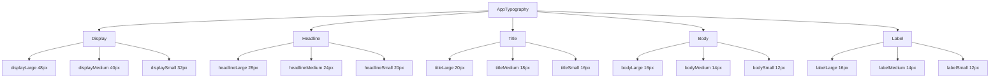
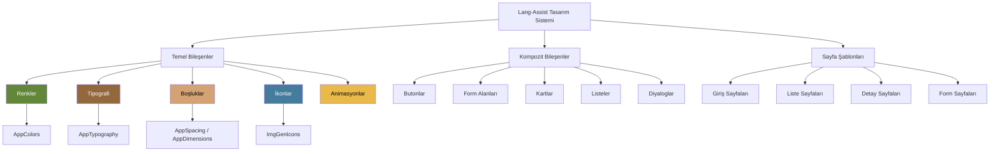

# Lang-Assist Flutter Styling Guide

Bu doküman, Lang-Assist uygulamalarında tutarlı bir kullanıcı arayüzü ve kod yapısı sağlamak için kullanılacak styling standartlarını içerir. Tüm Flutter geliştiricileri bu kılavuzu takip etmelidir.

## İçindekiler

- [Renk Sistemi](#renk-sistemi)
- [Tipografi](#tipografi)
- [Boşluk ve Ölçüler](#boşluk-ve-ölçüler)
- [Tema](#tema)
- [İkonlar](#i̇konlar)
- [Animasyonlar](#animasyonlar)
- [Kullanım Örnekleri](#kullanım-örnekleri)
- [Tasarım Sistemi Mimarisi](#tasarım-sistemi-mimarisi)

## Renk Sistemi

Lang-Assist, hem açık hem de koyu tema için tutarlı bir renk paleti kullanır. Tüm renkler `AppColors` sınıfı üzerinden erişilebilir.

### Ana Renkler

```dart
AppColors.primary      // Ana yeşil renk (#638738)
AppColors.onPrimary    // Primary üzerindeki içerik rengi (genellikle beyaz)
AppColors.secondary    // İkincil renk (kahverengi #94683D)
AppColors.onSecondary  // Secondary üzerindeki içerik rengi
AppColors.accent       // Vurgu rengi (altın sarısı #D4A373)
```

### Yüzey ve Metin Renkleri

```dart
AppColors.surface       // Arka plan rengi (açık/koyu temaya göre değişir)
AppColors.onSurface     // Yüzey üzerindeki içerik rengi
AppColors.textPrimary   // Ana metin rengi
AppColors.textSecondary // İkincil metin rengi
AppColors.textHint      // İpucu metni rengi
AppColors.grey          // Nötr gri-kahve tonları
```

### Durum Renkleri

```dart
AppColors.success  // Başarı durumu (yeşil)
AppColors.warning  // Uyarı durumu (sarı)
AppColors.error    // Hata durumu (kırmızı)
AppColors.onError  // Hata üzerindeki içerik rengi
AppColors.info     // Bilgi durumu (mavi)
```

### Gradyanlar

```dart
AppColors.primaryGradient    // Ana yeşil gradyan
AppColors.highlightGradient  // Vurgu gradyanı
```

### Renk Sistemi Görselleştirmesi

```mermaid
graph TD
    A[AppColors] --> B[Ana Renkler]
    A --> C[Yüzey ve Metin Renkleri]
    A --> D[Durum Renkleri]
    A --> E[Gradyanlar]

    B --> B1[primary #638738]
    B --> B2[onPrimary #F8F7F5]
    B --> B3[secondary #94683D]
    B --> B4[onSecondary #FFF8F0]
    B --> B5[accent #D4A373]

    C --> C1[surface]
    C --> C2[onSurface]
    C --> C3[textPrimary]
    C --> C4[textSecondary]
    C --> C5[textHint]
    C --> C6[grey]

    D --> D1[success]
    D --> D2[warning #E9B949]
    D --> D3[error]
    D --> D4[onError]
    D --> D5[info]

    E --> E1[primaryGradient]
    E --> E2[highlightGradient]

    style B1 fill:#638738,color:white
    style B2 fill:#F8F7F5,color:black
    style B3 fill:#94683D,color:white
    style B4 fill:#FFF8F0,color:black
    style B5 fill:#D4A373,color:black
    style D2 fill:#E9B949,color:black
```



## Tipografi

Tipografi sistemi, Material Design tipografi ölçeklerine dayanır ve `typo` global değişkeni üzerinden erişilebilir.

```dart
// Ana metin stilleri
typo.headlineLarge
typo.headlineMedium
typo.headlineSmall
typo.titleLarge
typo.titleMedium
typo.titleSmall
typo.bodyLarge
typo.bodyMedium
typo.bodySmall
typo.labelLarge
typo.labelMedium
typo.labelSmall
typo.displayLarge
typo.displayMedium
typo.displaySmall

// İkincil metin rengi için
typo.secondary.bodyMedium

// İpucu metni rengi için
typo.hint.bodySmall
```

### Tipografi Hiyerarşisi



## Boşluk ve Ölçüler

Lang-Assist, tutarlı bir arayüz için standartlaştırılmış boşluk ve ölçü değerleri kullanır.

### Boşluk (Spacing)

`AppSpacing` sınıfı, uygulamada kullanılan standart boşluk değerlerini içerir:

```dart
AppSpacing.xxs  // 2.0
AppSpacing.xs   // 4.0
AppSpacing.sm   // 8.0
AppSpacing.md   // 16.0
AppSpacing.lg   // 24.0
AppSpacing.xl   // 32.0
AppSpacing.xxl  // 40.0
```

### Özel Boşluk Değerleri

```dart
AppSpacing.buttonHeight   // 48.0
AppSpacing.inputHeight    // 48.0
AppSpacing.cardPadding    // 16.0 (md)
AppSpacing.sectionSpacing // 32.0 (xl)
AppSpacing.pageMargin     // 24.0 (lg)
```

### Köşe Yuvarlaklığı (Border Radius)

```dart
AppSpacing.radiusXs  // 4.0
AppSpacing.radiusSm  // 8.0
AppSpacing.radiusMd  // 12.0
AppSpacing.radiusLg  // 16.0
AppSpacing.radiusXl  // 24.0
```

### Yükseltme (Elevation)

```dart
AppSpacing.elevationXs  // 2.0
AppSpacing.elevationSm  // 4.0
AppSpacing.elevationMd  // 8.0
AppSpacing.elevationLg  // 16.0
AppSpacing.elevationXl  // 24.0
```

### Alternatif Boyutlandırma Sistemi

`AppDimensions` sınıfı, alternatif bir boyutlandırma sistemi sunar:

```dart
// Spacing değerleri
AppDimensions.spacing1  // 4
AppDimensions.spacing2  // 8
AppDimensions.spacing3  // 12
AppDimensions.spacing4  // 16
AppDimensions.spacing5  // 18
AppDimensions.spacing6  // 24
AppDimensions.spacing7  // 40

// Radius değerleri
AppDimensions.radiusNone       // 0
AppDimensions.radiusSmall      // 8
AppDimensions.radiusMedium     // 12
AppDimensions.radiusLarge      // 18
AppDimensions.radiusExtraLarge // 24

// Border Radius nesneleri
AppDimensions.borderRadiusNone
AppDimensions.borderRadiusSmall
AppDimensions.borderRadiusMedium
AppDimensions.borderRadiusLarge
AppDimensions.borderRadiusExtraLarge
```

## Tema

Lang-Assist, açık ve koyu tema desteği sunar. Tema, `ThemeProvider` sınıfı üzerinden yönetilir.

```dart
// Mevcut tema parlaklığını kontrol etme
ThemeProvider.instance.currentBrightness

// Koyu tema kontrolü
ThemeProvider.instance.isDark

// Tema değiştirme
ThemeProvider.instance.setBrightness(Brightness.dark)
```

## İkonlar

İkonlar, `ImgGenIcons` sınıfı üzerinden erişilebilir. Tüm ikonlar SVG formatındadır.

```dart
// Genel ikon kullanımı
ImgGenIcons.name(ImgGenIconNames.back, size: 24, color: AppColors.primary)

// Özel ikon yardımcıları
ImgGenIcons.back()
ImgGenIcons.close()
ImgGenIcons.google()
ImgGenIcons.apple()
ImgGenIcons.email()
ImgGenIcons.pwdVisibility(isVisible)
```

## Animasyonlar

Standart animasyon süresi:

```dart
animationDuration  // 150ms
```

## Kullanım Örnekleri

### Buton Örneği

```dart
ElevatedButton(
  style: ElevatedButton.styleFrom(
    backgroundColor: AppColors.primary,
    foregroundColor: AppColors.onPrimary,
    padding: EdgeInsets.symmetric(
      horizontal: AppSpacing.lg,
      vertical: AppSpacing.md,
    ),
    shape: RoundedRectangleBorder(
      borderRadius: BorderRadius.circular(AppSpacing.radiusMd),
    ),
    elevation: AppSpacing.elevationSm,
  ),
  onPressed: () {},
  child: Text('Kaydet', style: typo.labelLarge),
)
```

### Kart Örneği

```dart
Card(
  elevation: AppSpacing.elevationSm,
  shape: RoundedRectangleBorder(
    borderRadius: BorderRadius.circular(AppSpacing.radiusMd),
  ),
  color: AppColors.surface,
  child: Padding(
    padding: EdgeInsets.all(AppSpacing.cardPadding),
    child: Column(
      crossAxisAlignment: CrossAxisAlignment.start,
      children: [
        Text('Başlık', style: typo.titleMedium),
        SizedBox(height: AppSpacing.sm),
        Text('İçerik metni', style: typo.bodyMedium),
        SizedBox(height: AppSpacing.md),
        Row(
          children: [
            ImgGenIcons.email(size: 20, color: AppColors.primary),
            SizedBox(width: AppSpacing.xs),
            Text('İletişim', style: typo.secondary.labelMedium),
          ],
        ),
      ],
    ),
  ),
)
```

### Form Alanı Örneği

```dart
TextFormField(
  decoration: InputDecoration(
    labelText: 'E-posta',
    hintText: 'ornek@email.com',
    hintStyle: typo.hint.bodyMedium,
    labelStyle: typo.secondary.bodyMedium,
    filled: true,
    fillColor: AppColors.inputBackground,
    border: OutlineInputBorder(
      borderRadius: BorderRadius.circular(AppSpacing.radiusSm),
      borderSide: BorderSide.none,
    ),
    contentPadding: EdgeInsets.symmetric(
      horizontal: AppSpacing.md,
      vertical: AppSpacing.sm,
    ),
    prefixIcon: Padding(
      padding: EdgeInsets.only(left: AppSpacing.sm, right: AppSpacing.xs),
      child: ImgGenIcons.email(),
    ),
  ),
  style: typo.bodyMedium,
)
```

## Tema Geçişleri

Tema geçişlerinde animasyon kullanımı:

```dart
AnimatedContainer(
  duration: animationDuration,
  color: AppColors.surface,
  child: YourWidget(),
)
```

## Tasarım Sistemi Mimarisi

Lang-Assist tasarım sistemi, aşağıdaki bileşenlerden oluşur:



---

Bu styling guide, Lang-Assist uygulamalarında tutarlı bir kullanıcı deneyimi sağlamak için tasarlanmıştır. Herhangi bir sorunuz veya öneriniz varsa, lütfen geliştirici ekibiyle iletişime geçin.
