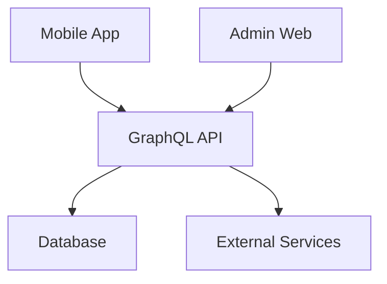

# AI Agent Documentation Guide

## Overview

This document provides guidelines for creating and structuring documentation specifically designed for AI agents working with the Lang-Assist project. Effective AI-oriented documentation enables AI assistants to provide more accurate, contextually relevant support for development tasks.

## Purpose of AI-Oriented Documentation

AI agents require specific types of information to effectively assist with development tasks:

1. **Context and Relationships**: Understanding how components interact within the system
2. **Implementation Details**: Knowledge of specific implementation choices and patterns
3. **Project Standards**: Awareness of coding standards, architectural decisions, and best practices
4. **Historical Context**: Understanding of why certain decisions were made

## Documentation Depth Levels

When creating documentation for AI agents, consider the following depth levels:

### Level 1: Overview (High-Level)

- System architecture diagrams
- Component relationships
- Technology stack overview
- Project goals and constraints

### Level 2: Component Documentation (Mid-Level)

- Component responsibilities
- API contracts
- Data flow descriptions
- State management approaches

### Level 3: Implementation Details (Low-Level)

- Specific algorithms
- Code patterns
- Edge cases
- Performance considerations

## AI-Specific Documentation Elements

### 1. Context Maps

Include relationship diagrams that show how different components interact:



### 2. Decision Records

Document important architectural or implementation decisions:

```markdown
## Decision: Use of GraphQL over REST

**Context**: Need for flexible data fetching across multiple clients

**Decision**: Implement GraphQL as the primary API layer

**Consequences**:

- Clients can request exactly the data they need
- Schema provides self-documentation
- Additional complexity in server implementation
```

### 3. Code Pattern Examples

Provide examples of common patterns used throughout the codebase:

```typescript
// Example of repository pattern implementation
class UserRepository {
  async findById(id: string): Promise<User> {
    // Implementation details
  }

  async save(user: User): Promise<void> {
    // Implementation details
  }
}
```

### 4. Cross-Reference Links

Include explicit links between related documentation:

```markdown
For more details on authentication flow, see [Authentication Process](./authentication-process.md).
```

## Documentation Structure for AI Consumption

### Project Map Document

Create a central "map" document that AI agents can use to navigate the project:

```markdown
# Lang-Assist Project Map

## Core Components

- [Mobile App](./mobile-app.md)
- [Admin Web](./admin-web.md)
- [Server](./server.md)

## Libraries

- [GQL Schema](./gql-schema.md)
- [Flutter API](./flutter-api.md)
- [Flutter Utils](./flutter-utils.md)

## Data Layers

- [User Data Layer](./user-data-layer.md)
- [Admin Data Layer](./admin-data-layer.md)
```

### Component Documentation Template

Use a consistent template for component documentation:

````markdown
# Component Name

## Purpose

Brief description of the component's purpose

## Responsibilities

- Responsibility 1
- Responsibility 2

## Dependencies

- Dependency 1
- Dependency 2

## Key Interfaces

```typescript
interface ExampleInterface {
  method1(): void;
  method2(param: string): Promise<Result>;
}
```
````

## Implementation Notes

Important details about the implementation

## Common Patterns

Examples of patterns used in this component

## Related Components

- [Related Component 1](./related-component-1.md)
- [Related Component 2](./related-component-2.md)

```

## Best Practices for AI-Oriented Documentation

1. **Be Explicit**: Avoid assumptions about implicit knowledge
2. **Provide Context**: Explain why certain approaches were chosen
3. **Include Examples**: Concrete examples help AI understand patterns
4. **Update Regularly**: Keep documentation in sync with code changes
5. **Cross-Reference**: Link related documents to help AI navigate the knowledge graph
6. **Highlight Constraints**: Document technical limitations or business constraints
7. **Document Edge Cases**: Include information about exception handling and edge cases

## Implementation Plan

To effectively document the Lang-Assist project for AI agents:

1. Create a project map document
2. Document each major component using the template
3. Add decision records for key architectural choices
4. Create relationship diagrams for system interactions
5. Document common patterns and conventions
6. Establish a process for keeping documentation updated

## Conclusion

Well-structured documentation designed with AI agents in mind will significantly enhance the ability of AI assistants to provide valuable support for the Lang-Assist project. By following these guidelines, we can create documentation that serves both human developers and AI agents effectively.
```
