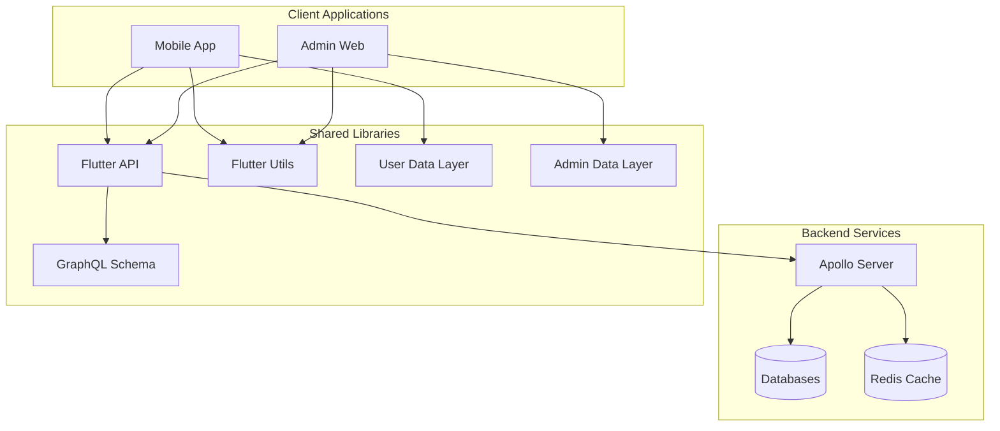
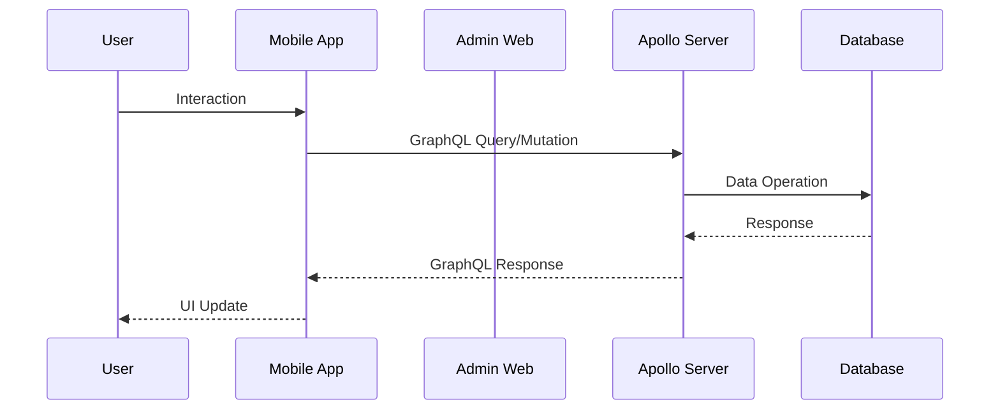

# Lang Assist Technical Architecture

## Overview

Lang Assist is a distributed system built with modern technologies to provide a comprehensive language learning platform. The system consists of several interconnected components, each serving a specific purpose in the overall architecture.

## System Components

## Component Details

### Client Applications

1. **Mobile Application** (`/bin/mobile`)

   - Flutter-based mobile application for end users
   - Implements user-facing features
   - Uses shared Flutter libraries for consistency
   - Communicates with backend via GraphQL

2. **Admin Web** (`/bin/admin-web`)
   - Flutter web application for platform administrators
   - Manages platform content and users
   - Shares common components with mobile app
   - Uses same GraphQL communication layer

### Backend Services

1. **Server** (`/bin/server`)
   - Apollo Server implementation
   - Handles all GraphQL operations
   - Manages database interactions
   - Implements business logic
   - Integrates caching layer

### Shared Libraries

1. **GQL** (`/lib/gql`)

   - Contains GraphQL schema definitions
   - Defines types and operations
   - Shared between client and server

2. **Flutter API** (`/lib/flutter-api`)

   - GraphQL client utilities for Flutter
   - Handles API communication
   - Manages authentication
   - Implements error handling

3. **Flutter Utils** (`/lib/flutter-utils`)

   - Shared UI components
   - Common utility functions
   - Cross-platform helpers

4. **Data Layers** (`/lib/user-data`, `/lib/admin-data`)
   - Data models and state management
   - GraphQL code generation
   - Type-safe data handling

## Design System

The design system (`/design`) provides:

- UI/UX guidelines
- Component patterns
- Cross-platform consistency
- Shared assets and resources

## Communication Flow

## Technology Stack

- **Frontend**: Flutter, Dart
- **Backend**: Node.js, Express, Apollo Server
- **Database**: MongoDB, PostgreSQL
- **Caching**: Redis
- **API**: GraphQL
- **Design**: Figma, Flutter widgets

## Security Considerations

- GraphQL API secured with authentication
- Role-based access control
- Encrypted data transmission
- Secure storage practices
- Rate limiting implementation
