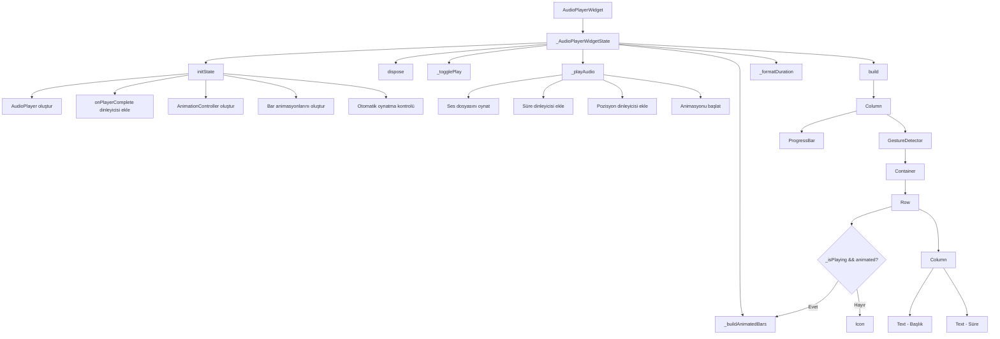

# AudioPlayerWidget

AudioPlayerWidget, ses dosyalarını oynatmak için kullanılan estetik ve özelleştirilebilir bir Flutter bileşenidir. Bu bileşen, kullanıcı arayüzünde ses dosyalarını oynatmak için kullanılabilir ve çeşitli özelleştirme seçenekleri sunar.

## Özellikler

- Ses dosyalarını oynatma ve duraklatma
- Çalma durumunda animasyon gösterme
- İlerleme çubuğu ile oynatma durumunu görsel olarak gösterme
- Süre bilgisini gösterme (geçen süre / toplam süre)
- Genişleyebilir tasarım (yatay olarak)
- Özelleştirilebilir renk, arka plan rengi ve köşe yuvarlaklığı
- Özelleştirilebilir ikon boyutu
- Otomatik oynatma seçeneği

## Kullanım

```dart
AudioPlayerWidget(
  audioId: 'audio_file_id',
  horizontalExpanded: true,
  animated: true,
  showProgressBar: true,
  color: Colors.blue,
  backgroundColor: Colors.white,
  borderRadius: BorderRadius.circular(16),
  iconSize: 28.0,
  autoPlay: false,
  onComplete: () {
    print('Audio playback completed');
  },
)
```

## Parametreler

| Parametre            | Tip             | Varsayılan                  | Açıklama                                                       |
| -------------------- | --------------- | --------------------------- | -------------------------------------------------------------- |
| `audioId`            | `String`        | (Zorunlu)                   | Oynatılacak ses dosyasının ID'si                               |
| `horizontalExpanded` | `bool`          | `false`                     | Bileşenin yatay olarak genişleyip genişlemeyeceği              |
| `animated`           | `bool`          | `true`                      | Çalma sırasında animasyon gösterilip gösterilmeyeceği          |
| `showProgressBar`    | `bool`          | `true`                      | İlerleme çubuğunun gösterilip gösterilmeyeceği                 |
| `color`              | `Color?`        | `theme.primaryColor`        | İkon, metin ve ilerleme çubuğu rengi                           |
| `backgroundColor`    | `Color?`        | `theme.cardColor`           | Arka plan rengi                                                |
| `borderRadius`       | `BorderRadius?` | `BorderRadius.circular(12)` | Köşe yuvarlaklığı                                              |
| `iconSize`           | `double`        | `24.0`                      | İkon boyutu                                                    |
| `onComplete`         | `VoidCallback?` | `null`                      | Ses dosyası tamamlandığında çağrılacak fonksiyon               |
| `autoPlay`           | `bool`          | `false`                     | Widget oluşturulduğunda otomatik oynatma yapılıp yapılmayacağı |

## İç Yapı

AudioPlayerWidget, `StatefulWidget` sınıfından türetilmiştir ve `SingleTickerProviderStateMixin` ile animasyon desteği sağlar. Bileşen, ses dosyasını oynatmak için `audioplayers` paketini kullanır.

### Durum Yönetimi

Bileşen, aşağıdaki durumları yönetir:

- `_isPlaying`: Ses dosyasının çalıp çalmadığını belirtir
- `_player`: AudioPlayer nesnesi
- `_animationController`: Animasyon kontrolcüsü
- `_barAnimations`: Çubuk animasyonları için animasyon listesi
- `_duration`: Ses dosyasının toplam süresi
- `_position`: Ses dosyasının mevcut pozisyonu
- `_progress`: İlerleme değeri (0.0 - 1.0 arasında)

### Animasyon

Çalma durumunda, bileşen üç çubuktan oluşan bir animasyon gösterir. Her çubuk, farklı bir animasyon eğrisi ile hareket eder, böylece daha doğal bir ses dalgası efekti oluşturulur.

### İlerleme Çubuğu

Bileşen, ses dosyasının ilerleme durumunu göstermek için `ProgressBar` widget'ını kullanır. İlerleme çubuğu, ses dosyasının mevcut pozisyonuna göre güncellenir.



## Örnek Kullanım Senaryoları

### Basit Kullanım

```dart
AudioPlayerWidget(
  audioId: 'audio_file_id',
)
```

### İlerleme Çubuklu Genişletilmiş Buton

```dart
AudioPlayerWidget(
  audioId: 'audio_file_id',
  horizontalExpanded: true,
  showProgressBar: true,
)
```

### Özelleştirilmiş Görünüm

```dart
AudioPlayerWidget(
  audioId: 'audio_file_id',
  color: Colors.purple,
  backgroundColor: Colors.grey[200],
  borderRadius: BorderRadius.circular(24),
  iconSize: 32.0,
  showProgressBar: true,
)
```

### Otomatik Oynatma

```dart
AudioPlayerWidget(
  audioId: 'audio_file_id',
  autoPlay: true,
  onComplete: () {
    // Oynatma tamamlandığında yapılacak işlemler
  },
)
```

## Bağımlılıklar

- `audioplayers`: Ses dosyalarını oynatmak için kullanılır
- `flutter/material.dart`: Flutter materyal tasarım bileşenleri için kullanılır
- `ProgressBar`: İlerleme çubuğunu göstermek için kullanılır

## Notlar

- Ses dosyası ID'si, `audioIdToUrl` fonksiyonu kullanılarak URL'ye dönüştürülür
- Bileşen, ses dosyası tamamlandığında otomatik olarak durumu günceller
- Bileşen, dispose edildiğinde AudioPlayer, AnimationController ve StreamSubscription'ları temizler
- İlerleme çubuğu, ses dosyasının mevcut pozisyonuna göre otomatik olarak güncellenir
