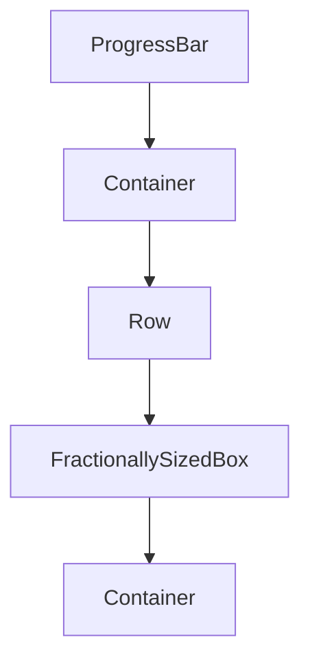

# ProgressBar Widget

ProgressBar, ilerleme durumunu görsel olarak gösteren yeniden kullanılabilir bir Flutter bileşenidir. Bu bileşen, ses dosyaları, video oynatma, yükleme işlemleri gibi çeşitli ilerleme durumlarını göstermek için kullanılabilir.

## Özellikler

- İlerleme durumunu görsel olarak gösterme (0.0 - 1.0 arasında)
- Özelleştirilebilir yükseklik
- Özelleştirilebilir arka plan ve ilerleme renkleri
- Özelleştirilebilir kenar yuvarlaklığı

## Kullanım

```dart
ProgressBar(
  progress: 0.75, // %75 ilerleme
  height: 6.0,
  backgroundColor: Colors.grey[200],
  progressColor: Colors.blue,
  borderRadius: BorderRadius.circular(3.0),
)
```

## Parametreler

| Parametre         | Tip             | Varsayılan                          | Açıklama                             |
| ----------------- | --------------- | ----------------------------------- | ------------------------------------ |
| `progress`        | `double`        | (Zorunlu)                           | İlerleme değeri (0.0 - 1.0 arasında) |
| `height`          | `double`        | `4.0`                               | Çubuğun yüksekliği                   |
| `backgroundColor` | `Color?`        | `theme.colorScheme.surfaceVariant`  | Arka plan rengi                      |
| `progressColor`   | `Color?`        | `theme.primaryColor`                | İlerleme rengi                       |
| `borderRadius`    | `BorderRadius?` | `BorderRadius.circular(height / 2)` | Kenar yuvarlaklığı                   |

## İç Yapı

ProgressBar, basit bir StatelessWidget olarak tasarlanmıştır. İlerleme değerini görsel olarak göstermek için FractionallySizedBox kullanır.



## Örnek Kullanım Senaryoları

### Ses Oynatıcı İlerleme Çubuğu

```dart
AudioPlayerWidget(
  audioId: 'audio_file_id',
  showProgressBar: true,
)
```

### Yükleme İlerleme Çubuğu

```dart
ProgressBar(
  progress: downloadProgress,
  height: 8.0,
  progressColor: Colors.green,
)
```

### Video Oynatıcı İlerleme Çubuğu

```dart
ProgressBar(
  progress: videoPosition / videoDuration,
  height: 5.0,
  backgroundColor: Colors.grey[800],
  progressColor: Colors.red,
)
```

## Notlar

- `progress` değeri otomatik olarak 0.0 ile 1.0 arasında sınırlandırılır
- Eğer `backgroundColor` veya `progressColor` belirtilmezse, tema renkleri kullanılır
- Eğer `borderRadius` belirtilmezse, çubuğun yüksekliğine göre otomatik olarak hesaplanır
