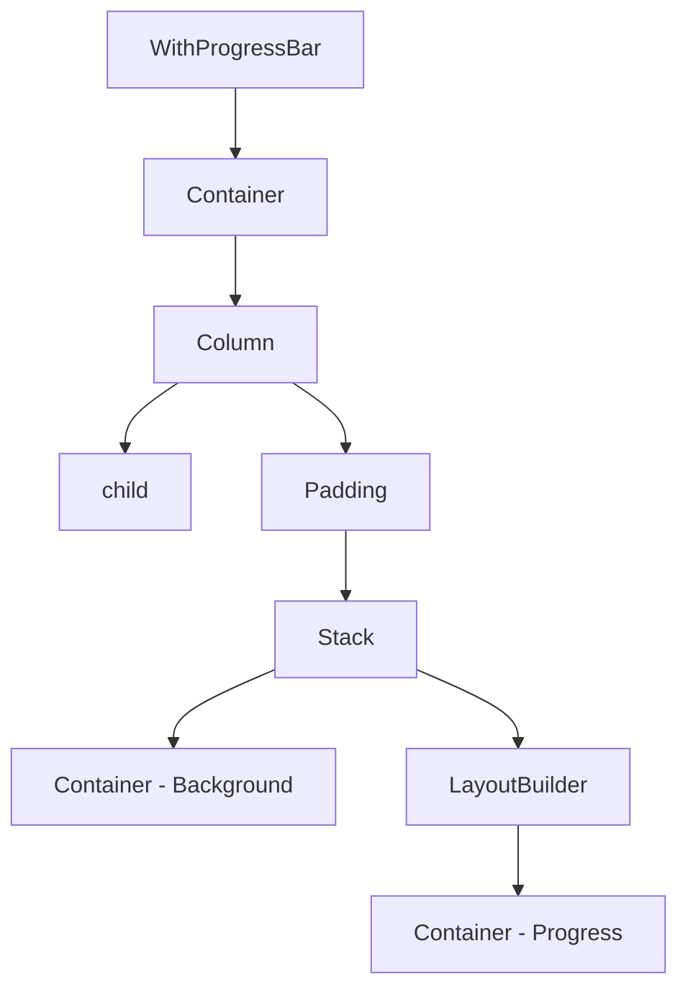

# WithProgressBar Widget

WithProgressBar, herhangi bir widget'ı ilerleme çubuğu ile birleştiren yeniden kullanılabilir bir Flutter bileşenidir. Bu bileşen, ses dosyaları, video oynatma, yükleme işlemleri gibi çeşitli ilerleme durumlarını göstermek için kullanılabilir.

## Özellikler

- Herhangi bir widget'ı ilerleme çubuğu ile birleştirme
- İlerleme durumunu görsel olarak gösterme (0.0 - 1.0 arasında)
- Özelleştirilebilir yükseklik
- Özelleştirilebilir ilerleme rengi
- Özelleştirilebilir kenar yuvarlaklığı
- Özelleştirilebilir padding
- Özelleştirilebilir container dekorasyonu

## Kullanım

```dart
WithProgressBar(
  progress: 0.75, // %75 ilerleme
  child: Container(
    height: 48,
    color: Colors.blue[100],
    child: Center(
      child: Text('İçerik Yükleniyor...'),
    ),
  ),
  height: 6.0,
  progressColor: Colors.blue,
  borderRadius: BorderRadius.circular(3.0),
  padding: EdgeInsets.symmetric(horizontal: 8.0, vertical: 4.0),
)
```

## Parametreler

| Parametre             | Tip                  | Varsayılan                                             | Açıklama                                   |
| --------------------- | -------------------- | ------------------------------------------------------ | ------------------------------------------ |
| `child`               | `Widget`             | (Zorunlu)                                              | İlerleme çubuğu ile birleştirilecek widget |
| `progress`            | `double`             | (Zorunlu)                                              | İlerleme değeri (0.0 - 1.0 arasında)       |
| `height`              | `double`             | `4.0`                                                  | İlerleme çubuğunun yüksekliği              |
| `progressColor`       | `Color?`             | `theme.primaryColor`                                   | İlerleme çubuğu rengi                      |
| `borderRadius`        | `BorderRadius?`      | `BorderRadius.circular(height / 2)`                    | İlerleme çubuğu kenar yuvarlaklığı         |
| `padding`             | `EdgeInsetsGeometry` | `EdgeInsets.symmetric(horizontal: 4.0, vertical: 8.0)` | İlerleme çubuğu etrafındaki padding        |
| `containerDecoration` | `BoxDecoration?`     | `null`                                                 | Dış container'ın dekorasyonu               |

## İç Yapı

WithProgressBar, bir Stack widget'ı kullanarak ilerleme çubuğunu oluşturur. İlerleme çubuğu, LayoutBuilder kullanılarak dinamik olarak boyutlandırılır.



## Örnek Kullanım Senaryoları

### Ses Oynatıcı İlerleme Çubuğu

```dart
WithProgressBar(
  progress: audioProgress,
  child: AudioPlayerContent(),
  progressColor: Colors.blue,
  containerDecoration: BoxDecoration(
    color: Colors.white,
    borderRadius: BorderRadius.circular(12),
    boxShadow: [
      BoxShadow(
        color: Colors.black.withOpacity(0.05),
        blurRadius: 8,
        offset: Offset(0, 2),
      ),
    ],
  ),
)
```

### Yükleme İlerleme Çubuğu

```dart
WithProgressBar(
  progress: downloadProgress,
  child: DownloadInfoWidget(),
  height: 8.0,
  progressColor: Colors.green,
)
```

### Video Oynatıcı İlerleme Çubuğu

```dart
WithProgressBar(
  progress: videoPosition / videoDuration,
  child: VideoPlayerWidget(),
  height: 5.0,
  progressColor: Colors.red,
  padding: EdgeInsets.only(bottom: 4.0),
)
```

## AudioPlayerWidget ile Kullanımı

WithProgressBar, AudioPlayerWidget ile birlikte kullanılarak ses dosyalarının ilerleme durumunu göstermek için kullanılabilir:

```dart
if (showProgressBar) {
  return WithProgressBar(
    progress: _progress,
    progressColor: color,
    containerDecoration: BoxDecoration(
      color: backgroundColor,
      borderRadius: borderRadius,
      boxShadow: [
        BoxShadow(
          color: Colors.black.withOpacity(0.05),
          blurRadius: 8,
          offset: Offset(0, 2),
        ),
      ],
    ),
    child: playerContent,
  );
} else {
  return playerContent;
}
```

## Notlar

- `progress` değeri otomatik olarak 0.0 ile 1.0 arasında sınırlandırılır
- Eğer `progressColor` belirtilmezse, tema renkleri kullanılır
- Eğer `borderRadius` belirtilmezse, çubuğun yüksekliğine göre otomatik olarak hesaplanır
- `containerDecoration` parametresi, dış container'ın görünümünü özelleştirmek için kullanılabilir
