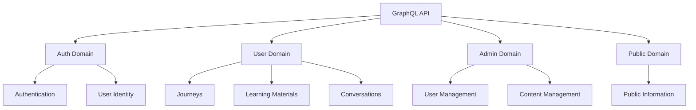

# Lang-Assist GraphQL API Overview

## Introduction

Lang-Assist platform uses GraphQL as its primary API layer, providing a flexible and efficient way for clients to interact with the server. This document provides an overview of the GraphQL API structure, key components, and how it's used throughout the platform.

## API Structure

The GraphQL API is organized into domains, each representing a specific area of functionality:



### Root Types

The API has three root types:

1. **Query**: For read operations
2. **Mutation**: For write operations
3. **Subscription**: For real-time updates

Each root type is divided into domains, allowing for a clear separation of concerns:

```graphql
type Query {
  admin: AdminQuery! @domain(domain: admin) @resolver(permissions: ["/admin/#"])
  auth: AuthQuery! @domain(domain: auth)
  public: PublicQuery! @domain(domain: public)
  user: UserQuery! @domain(domain: user) @resolver(permissions: ["/client/#"])
}

type Mutation {
  admin: AdminMutation!
    @domain(domain: admin)
    @resolver(permissions: ["/admin/#"])
  auth: AuthMutation! @domain(domain: auth)
  user: UserMutation!
    @domain(domain: user)
    @resolver(permissions: ["/client/#"])
  public: PublicMutation! @domain(domain: public)
}

type Subscription {
  start_conversation(materialId: ID!): ConversationUpdate!
    @domain(domain: user)
    @resolver(permissions: ["/client/#"])
}
```

## Domain Overview

### Auth Domain

The Auth domain handles user authentication and identity management:

- **Login/Registration**: Email, phone, and social login methods
- **Password Management**: Reset, change, and verification
- **Session Management**: Token handling and verification
- **User Identity**: Basic user information

Key operations include:

```graphql
type AuthMutation {
  login_email(input: LoginEmailRequest!): AuthResponse!
  register_email(input: RegisterEmailRequest!): AuthResponse!
  logout: Boolean!
  reset_password(input: ResetPasswordRequest!): Boolean!
  verify_email(input: VerifyEmailRequest!): AuthResponse!
  # ...other auth operations
}

type AuthQuery {
  me: MeResponse!
  check_provider(contact: Contact!): ProviderResponse!
}
```

### User Domain

The User domain handles language learning functionality for authenticated users:

- **Journeys**: Language learning paths
- **Materials**: Learning content and exercises
- **Conversations**: Interactive language practice
- **Progress Tracking**: User advancement through learning materials

Key operations include:

```graphql
type UserQuery {
  my_journeys: JourneyConnection!
  journey(id: ID!): Journey
  path_materials(
    journeyId: ID!
    pathID: String!
    pagination: PaginationInput
  ): MaterialConnection!
  material(id: ID!): Material
  conversation_turns(materialId: ID!): [ConversationTurn!]!
  # ...other user operations
}

type UserMutation {
  create_journey(input: CreateJourneyInput!): CreateJourneyResponse!
  create_path(input: CreatePathInput!): CreatePathResponse!
  answer_material(input: AnswerMaterialInput!): AnswerMaterialResponse!
  add_user_input(input: AddUserInputInput!): ConversationTurn!
  # ...other user operations
}
```

### Admin Domain

The Admin domain provides functionality for platform administrators:

- **User Management**: Managing platform users
- **Content Management**: Creating and managing learning content
- **System Configuration**: Platform settings and configuration

### Public Domain

The Public domain provides publicly accessible information:

- **General Information**: About the platform
- **Public Content**: Content available without authentication

## Custom Directives

The API uses several custom directives to enhance functionality:

- **@resolver**: Specifies permission requirements for resolvers
- **@domain**: Indicates which domain a field belongs to
- **@reference**: Marks a field as a document from a specific collection
- **@foreign_connection**: Defines paginated connections between collections
- **@paginate**: Enables pagination for a collection
- **@group_by**: Enables grouping for a collection

Example:

```graphql
type Query {
  user: UserQuery! @domain(domain: user) @resolver(permissions: ["/client/#"])
}
```

## Authentication and Authorization

The API implements a JWT-based authentication system:

1. **Authentication Flow**:

   - User logs in with credentials
   - Server validates credentials and issues a JWT token
   - Client includes the token in subsequent requests

2. **Authorization**:
   - The `@resolver` directive specifies required permissions
   - Permissions are checked before resolving fields
   - Different domains have different permission requirements

Example permission check:

```graphql
me: MeResponse!
  @resolver(
    permissions: [
      "/client/#" # Check if the same user
      "/admin/users/auth/read"
    ]
  )
```

## Data Models

Key data models in the API include:

1. **User**: Represents a platform user
2. **Journey**: Represents a language learning journey
3. **Material**: Represents learning content
4. **ConversationTurn**: Represents an interaction in a conversation

## Client Integration

The API is consumed by two main clients:

1. **Mobile App**: Uses the API for user-facing functionality
2. **Admin Web**: Uses the API for administrative functionality

Both clients use the same GraphQL schema, but access different parts based on their roles and permissions.

## Implementation Details

The GraphQL API is implemented using:

- **Apollo Server**: For the GraphQL server
- **TypeScript**: For type-safe server implementation
- **MongoDB/PostgreSQL**: For data storage
- **Redis**: For caching and session management

The schema is defined in `.graphql` files in the `lib/gql/schema` directory, making it easy to maintain and version.

## Conclusion

The Lang-Assist GraphQL API provides a flexible and powerful interface for clients to interact with the platform. By organizing functionality into domains and using custom directives for permissions, the API maintains a clean separation of concerns while ensuring proper access control.
