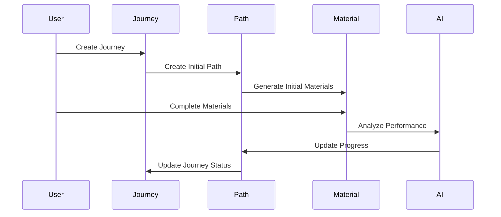

# Journey System Technical Documentation

## Overview

Journey sistemi, kullanıcıların dil öğrenme süreçlerini yönetmek için tasarlanmış merkezi bir yapıdır. Bu sistem, kullanıcıların öğrenme yolculuklarını, ilerlemelerini ve eğitim materyallerini organize eder.

## Core Components

### 1. Journey (Yolculuk)

```typescript
interface Journey {
  id: string;
  user_ID: string;
  name: string;
  avatar: string;
  status: "active" | "inactive";
  to: SupportedLanguage;
  aiModel: string;
  lastStudyDate: number;
}
```

Journey, bir kullanıcının belirli bir dil için başlattığı öğrenme sürecini temsil eder. Her journey:

- Hedef dil
- AI model tercihi
- Avatar ve isim gibi kişiselleştirme seçenekleri
- Son çalışma tarihi
  içerir.

### 2. UserPath (Kullanıcı Yolu)

```typescript
interface UserPath {
  id: string;
  user_ID: string;
  journey_ID: string;
  name: string;
  description?: string;
  isActive: boolean;
  isMain: boolean;
  type: PathType;
  progress: PathProgress;
  lastStudyDate?: number;
  profession?: string;
}
```

UserPath, bir journey içindeki spesifik öğrenme rotasını temsil eder:

- Initial path: İlk seviye belirleme
- Main path: Ana öğrenme yolu
- Custom paths: Özel çalışma alanları

### 3. PathProgress (İlerleme)

```typescript
interface PathProgress {
  level: {
    listening: number;
    reading: number;
    speaking: number;
    writing: number;
    grammar: number;
    vocabulary: number;
  };
  completedActivities: number;
  strongPoints: string[];
  weakPoints: string[];
  observations: string[];
}
```

Her path için detaylı ilerleme metrikleri tutar:

- Dil becerilerine göre seviyeler
- Tamamlanan aktiviteler
- Güçlü ve zayıf yönler
- AI gözlemleri

## System Flow



## Implementation Details

### 1. Journey Creation

```typescript
async function createJourney(user: User, input: CreateJourneyInput) {
  // 1. Create Journey
  const journey = await Journey.create({
    user_ID: user.id,
    name: input.name,
    to: input.to,
    aiModel: input.model,
  });

  // 2. Create Initial Path
  const path = await UserPath.create({
    journey_ID: journey.id,
    type: "INITIAL",
  });

  // 3. Generate Initial Materials
  const materials = await Material.createInitial(path.id);

  return { journey, path, materials };
}
```

### 2. Progress Tracking

```typescript
async function updateProgress(pathId: string, materialResult: MaterialResult) {
  const path = await UserPath.findById(pathId);

  // Update skill levels
  path.progress.level = calculateNewLevels(path.progress.level, materialResult);

  // Update metrics
  path.progress.completedActivities++;
  path.lastStudyDate = Date.now();

  // Analyze and update points
  analyzePerformance(path, materialResult);

  await path.save();
}
```

### 3. Path Management

```typescript
async function managePaths(journeyId: string) {
  const paths = await UserPath.find({ journey_ID: journeyId });

  // Active path kontrolü
  const activePath = paths.find((p) => p.isActive && p.isMain);
  if (!activePath) {
    // Yeni main path oluştur
    await createMainPath(journeyId);
  }

  // İnaktif pathları arşivle
  await archiveInactivePaths(paths);
}
```

## Database Schema

### Collections

1. `journeys`:

   - Kullanıcı yolculukları
   - Journey meta verileri
   - AI model tercihleri

2. `user_paths`:

   - Öğrenme yolları
   - İlerleme metrikleri
   - Path durumları

3. `materials`:
   - Öğrenme materyalleri
   - Path bağlantıları
   - Materyal meta verileri

## Client Implementation

### Mobile App

```dart
class JourneyController extends VoidSignal {
  // Active journey state
  Fragment$DetailedJourney? _journey;

  // Initial path tracking
  Fragment$DetailedPath? _initPath;
  List<Fragment$DetailedMaterial>? _initMaterials;

  // Path management
  List<Fragment$DetailedPath> get paths =>
    _initPath != null ? [_initPath!] :
    journey.paths.where((e) => e.isActive).toList();

  // Journey persistence
  Future<void> setJourney(Fragment$Journey journey) async {
    final detailedJourney = await Api.queries.journey(journey.id);
    _journey = detailedJourney;
    await _persistJourneyId(journey.id);
    emit();
  }
}
```

### Web App

```typescript
class JourneyManager {
  // Journey state management
  private currentJourney: Journey;
  private activePath: UserPath;

  // Progress tracking
  async trackProgress(material: Material) {
    const result = await this.evaluateMaterial(material);
    await this.updatePathProgress(result);
    this.checkPathCompletion();
  }

  // Path navigation
  async navigateToNextMaterial() {
    const next = await this.findNextMaterial();
    if (next) {
      this.loadMaterial(next);
    } else {
      await this.completePath();
    }
  }
}
```

## Security Considerations

1. **Access Control**

   - Her journey ve path için user_ID kontrolü
   - Material erişimlerinde yetki doğrulaması
   - Progress güncellemelerinde kullanıcı validasyonu

2. **Data Validation**

   - Progress metriklerinin doğrulanması
   - Material completion kontrolü
   - Path state geçişlerinin validasyonu

3. **Rate Limiting**
   - Material generation limitleri
   - Progress update limitleri
   - Path creation limitleri

## Performance Optimizations

1. **Caching**

   - Active journey caching
   - Path progress caching
   - Material result caching

2. **Lazy Loading**

   - Material lazy loading
   - Path history lazy loading
   - Progress metrics lazy loading

3. **Batch Operations**
   - Bulk material generation
   - Batch progress updates
   - Group path operations
