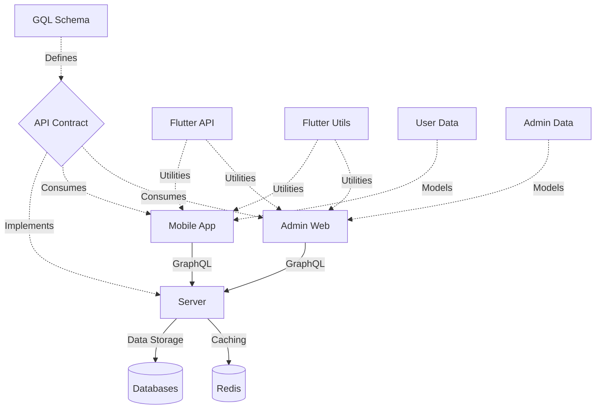
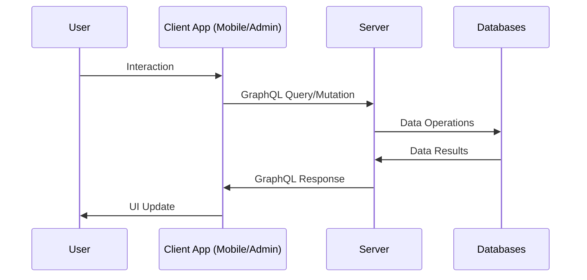
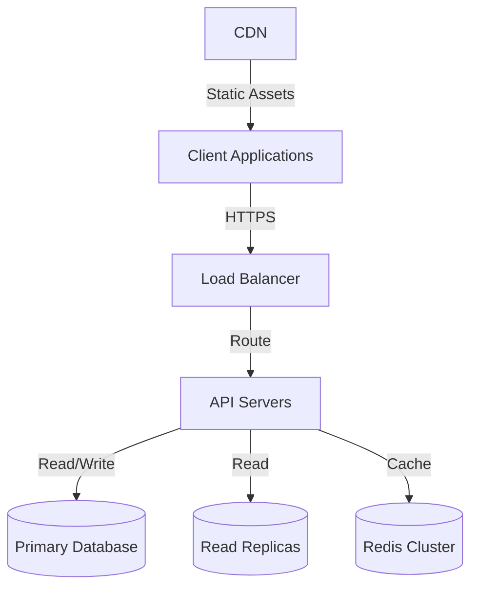

# Lang-Assist Platform Overview

## Introduction

Lang-Assist is a comprehensive platform designed to facilitate and support language learning. The platform consists of multiple interconnected components working together to provide a seamless experience for both users and administrators.

## System Architecture

The Lang-Assist platform is structured as a monorepo containing multiple sub-projects, each with its own specific responsibility. The architecture follows a client-server model with GraphQL as the communication layer between clients and the server.



### Core Components

#### Applications

1. **Mobile App** (`./bin/mobile/`)

   - User-facing mobile application built with Flutter
   - Provides language learning features for end users
   - Communicates with the server via GraphQL API
   - Key technologies: Flutter, Dart, GraphQL

2. **Admin Web** (`./bin/admin-web/`)

   - Web application for platform administrators
   - Provides tools for content management, user management, and analytics
   - Also built with Flutter for web
   - Key technologies: Flutter, Dart, GraphQL

3. **Server** (`./bin/server/`)
   - Backend server handling all API requests
   - Implements the GraphQL API defined in the GQL schema
   - Manages data storage, authentication, and business logic
   - Key technologies: Apollo Server, Node.js, Express, GraphQL, MongoDB, Redis, PostgreSQL

#### Libraries

1. **GQL** (`./lib/gql/`)

   - Contains GraphQL schema definitions and client queries
   - Serves as the contract between clients and server
   - Divided into:
     - Schema (`./lib/gql/schema/`): GraphQL type definitions, queries, and mutations
     - Client (`./lib/gql/client/`): Client-side queries and mutations

2. **Flutter API** (`./lib/flutter-api/`)

   - Utilities for working with GraphQL in Flutter applications
   - Provides abstractions for API calls, error handling, and data fetching

3. **Flutter Utils** (`./lib/flutter-utils/`)

   - General utility functions for Flutter applications
   - Includes common widgets, helpers, and extensions

4. **User Data** (`./lib/user-data/`)

   - Data models for user-related data
   - Used by the mobile application

5. **Admin Data** (`./lib/admin-data/`)
   - Data models for admin-related data
   - Used by the admin web application

#### Supporting Resources

1. **Design** (`./design/`)

   - Design system and UI patterns
   - Ensures consistency across all platform interfaces
   - Includes design tokens, components, and guidelines

2. **Documentation** (`./docs/`)
   - Platform documentation
   - Includes technical documentation, user guides, and API references

## Data Flow

The data flow in the Lang-Assist platform follows these general steps:

1. Client applications (Mobile App or Admin Web) make GraphQL queries or mutations
2. These requests are sent to the Server
3. The Server processes the requests, interacting with databases as needed
4. The Server returns the requested data in the format specified by the GraphQL schema
5. Client applications update their UI based on the received data



## Technology Stack

### Frontend

- **Flutter**: Cross-platform UI framework used for both mobile and web applications
- **Dart**: Programming language used with Flutter
- **GraphQL**: API query language for data fetching

### Backend

- **Node.js**: JavaScript runtime for the server
- **Express**: Web framework for Node.js
- **Apollo Server**: GraphQL server implementation
- **TypeScript**: Typed superset of JavaScript used for server-side code

### Databases

- **MongoDB**: NoSQL database for flexible data storage
- **PostgreSQL**: Relational database for structured data
- **Redis**: In-memory data store used for caching

### Development Tools

- **Git**: Version control system
- **GitHub**: Hosting for Git repositories
- **Markdown/Mermaid/Drawio**: Documentation tools

## Key Features

1. **Language Learning**

   - Interactive lessons
   - Progress tracking
   - Personalized learning paths

2. **Content Management**

   - Admin tools for creating and managing learning content
   - Content versioning and localization

3. **User Management**

   - User registration and authentication
   - User profiles and progress tracking
   - Role-based access control

4. **Analytics**
   - Learning metrics and insights
   - Usage statistics
   - Performance monitoring

## Development Workflow

The Lang-Assist platform follows a modular development approach:

1. Each sub-project is developed in its own repository
2. Changes are made in the respective repositories
3. The main repository is updated with the latest submodule references
4. Continuous integration ensures compatibility between components

### Setting Up the Development Environment

1. Clone the repository with submodules:

   ```bash
   git clone --recursive https://github.com/lang-assist/lang-assist.git
   ```

2. Update submodules:

   ```bash
   git submodule update --init --recursive
   ```

3. Follow the setup instructions in each sub-project's README for specific setup steps

## Authentication and Authorization

The platform implements a comprehensive authentication and authorization system:

1. **Authentication**

   - JWT-based authentication
   - Social login options
   - Multi-factor authentication

2. **Authorization**
   - Role-based access control
   - Permission-based actions
   - API-level security

## Deployment Architecture

The Lang-Assist platform is designed for cloud deployment:



## Conclusion

The Lang-Assist platform provides a comprehensive solution for language learning through its interconnected components. The modular architecture allows for independent development and scaling of different parts of the system while maintaining a cohesive user experience.

This overview document serves as an entry point to understanding the platform's architecture and components. For more detailed information about specific components, refer to their respective documentation.

## Next Steps

- Explore the GraphQL schema to understand the API capabilities
- Set up the development environment to start contributing
- Review the mobile and admin applications to understand the user interfaces
