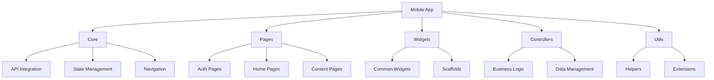
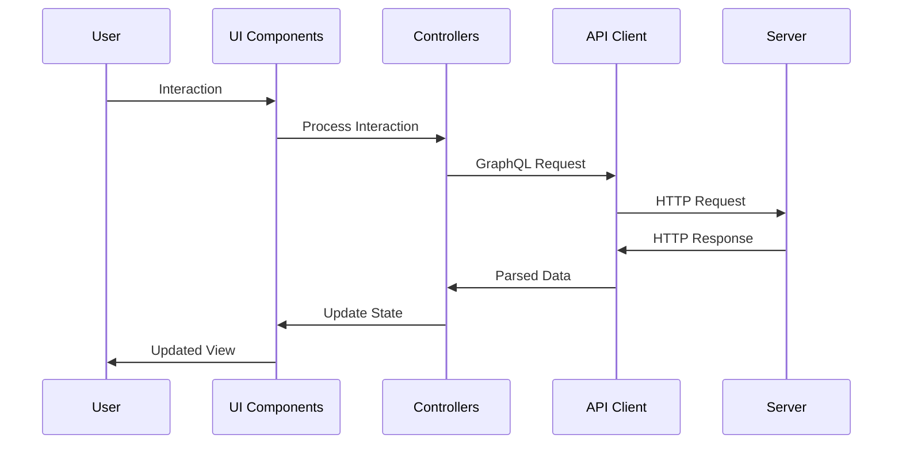

# Lang-Assist Mobile App Architecture

## Overview

The Lang-Assist mobile application is a Flutter-based client that provides language learning features to end users. It communicates with the backend server via GraphQL API and offers a rich, interactive learning experience.

## Application Structure

The mobile app follows a modular architecture with clear separation of concerns:



## Directory Structure

The mobile app's codebase is organized as follows:

```
bin/mobile/
├── lib/
│   ├── main.dart             # Application entry point
│   ├── widgets.dart          # Exported widgets
│   └── src/
│       ├── controllers/      # Business logic controllers
│       ├── core/             # Core functionality
│       ├── pages/            # UI screens
│       │   ├── auth/         # Authentication screens
│       │   ├── home/         # Home and journey screens
│       │   ├── content/      # Learning content screens
│       │   └── showcase/     # UI showcase
│       ├── scaffolds/        # Layout templates
│       ├── utils/            # Utility functions
│       ├── widgets/          # Reusable UI components
│       └── routes.dart       # Navigation routes
├── assets/                   # Static assets
├── pubspec.yaml              # Dependencies
└── test/                     # Tests
```

## Key Components

### Entry Point

The application starts in `main.dart`, which initializes the app and sets up the theme:

```dart
void main() async {
  usePathUrlStrategy();
  WidgetsFlutterBinding.ensureInitialized();
  GoRouter.optionURLReflectsImperativeAPIs = true;
  await ThemeProvider.instance.init();
  runApp(const MyApp());
}
```

### Navigation

The app uses GoRouter for navigation, with routes defined in `src/routes.dart`. Routes are categorized into three types:

1. Routes that don't require authentication but redirect if authenticated
2. Routes that don't care about authentication status
3. Routes that require authentication

```dart
/// Rotalar 3 kategoriye ayrılır:
///
/// 1 - Auth gerektirmeyen ama auth ise redirect edenler
/// 2 - Auth olup olmaması fark etmeyenler
/// 3 - Kalanları ise auth gerektirenler

final Map<String, AppRoute> routes = {
  "/auth": AppRoute(builder: SignUpMainScreen.new, middlewares: {}),
  "/": AppRoute(builder: HomePage.new, middlewares: {}),
  "/theme": AppRoute(builder: ThemeShowcase.new, middlewares: {}),
  "/journeys": AppRoute(builder: JourneysPage.new, middlewares: {}),
  "/journeys/create": AppRoute(builder: CreateJourneyPage.new, middlewares: {}),
  // ...other routes
}
```

### API Integration

The app integrates with the backend using the Flutter API library, which provides GraphQL client functionality:

```dart
return ApiWrapper(
  child: MaterialApp.router(
    // ...configuration
  ),
);
```

### Pages

The app contains several key page types:

1. **Authentication Pages**: Login, registration, and password management
2. **Home Pages**: Dashboard, journey list, and journey creation
3. **Content Pages**: Learning materials, exercises, and conversations
4. **Utility Pages**: Settings, profile, and help

### Controllers

Controllers manage business logic and state:

1. **JourneyController**: Manages language learning journeys
2. **PathController**: Manages learning paths within journeys
3. **MaterialController**: Manages learning materials and exercises
4. **AuthController**: Manages authentication state

### Theming

The app supports both light and dark themes, with a theme provider that handles theme switching:

```dart
MaterialApp.router(
  key: _key,
  title: 'Berber',
  debugShowCheckedModeBanner: false,
  routerConfig: router,
  darkTheme: AppTheme.dark,
  theme: AppTheme.light,
  themeMode:
      ThemeProvider.instance.currentBrightness == Brightness.dark
          ? ThemeMode.dark
          : ThemeMode.light,
  themeAnimationStyle: AnimationStyle(
    duration: animationDuration,
    curve: Curves.easeInOut,
  ),
)
```

## Data Flow

The data flow in the mobile app follows these general steps:

1. User interacts with the UI
2. Controllers process the interaction
3. API calls are made to the server via GraphQL
4. Responses are processed and state is updated
5. UI is updated to reflect the new state



## Key Features

### Language Learning Journeys

Users can create and manage language learning journeys:

- Create a new journey for a specific language
- Track progress through learning materials
- View statistics and achievements

### Interactive Learning Materials

The app provides various types of learning materials:

- Text-based lessons
- Interactive exercises
- Conversation practice
- Vocabulary building

### Personalization

The learning experience is personalized for each user:

- Adaptive learning paths based on proficiency
- Personalized recommendations
- Progress tracking and feedback

## Dependencies

The mobile app relies on several key dependencies:

- **Flutter**: UI framework
- **Dart**: Programming language
- **GoRouter**: Navigation
- **GraphQL**: API communication
- **Provider**: State management
- **Flutter Utils**: Utility functions from the shared library
- **Flutter API**: GraphQL client from the shared library
- **User Data**: Data models from the shared library

## Testing

The app includes tests in the `test/` directory:

- Unit tests for business logic
- Widget tests for UI components
- Integration tests for end-to-end functionality

## Conclusion

The Lang-Assist mobile app provides a comprehensive language learning experience through a well-structured Flutter application. Its modular architecture allows for easy maintenance and extension, while the integration with the GraphQL API ensures efficient communication with the backend server.
