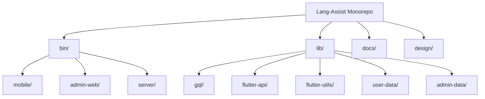

# Lang-Assist Project Map

## Overview

This document serves as a central navigation guide for the Lang-Assist project, providing links to key documentation and explaining the relationships between different components. It is designed to help both human developers and AI agents understand the project structure and find relevant information quickly.

## Project Structure

Lang-Assist is organized as a monorepo with multiple sub-projects:

## Core Components

### Applications

1. **Mobile App** (`./bin/mobile/`)

   - User-facing mobile application
   - Technologies: Flutter, Dart, GraphQL
   - [Mobile App Documentation](./components/mobile-app.md)

2. **Admin Web** (`./bin/admin-web/`)

   - Admin dashboard web application
   - Technologies: Flutter, Dart, GraphQL
   - [Admin Web Documentation](./components/admin-web.md)

3. **Server** (`./bin/server/`)
   - Backend server handling API requests
   - Technologies: Apollo Server, Node.js, Express, GraphQL, MongoDB, Redis, PostgreSQL
   - [Server Documentation](./components/server.md)

### Libraries

1. **GQL** (`./lib/gql/`)

   - GraphQL schema definitions and client queries
   - Contains: Schema definitions (`./lib/gql/schema`), Client queries (`./lib/gql/client`)
   - [GQL Documentation](./libraries/gql.md)

2. **Flutter API** (`./lib/flutter-api/`)

   - GraphQL API utilities for Flutter applications
   - [Flutter API Documentation](./libraries/flutter-api.md)

3. **Flutter Utils** (`./lib/flutter-utils/`)

   - Utility functions for Flutter applications
   - [Flutter Utils Documentation](./libraries/flutter-utils.md)

4. **User Data Layer** (`./lib/user-data/`)

   - Data models for user-related data
   - [User Data Layer Documentation](./libraries/user-data.md)

5. **Admin Data Layer** (`./lib/admin-data/`)
   - Data models for admin-related data
   - [Admin Data Layer Documentation](./libraries/admin-data.md)

### Supporting Resources

1. **Design** (`./design/`)

   - Design system and UI patterns
   - [Design Documentation](../design/design-system.md)

2. **Documentation** (`./docs/`)
   - Project documentation
   - [Documentation Guidelines](./documentation-guidelines.md)

## Key Workflows

1. **Development Workflow**

   - [Development Environment Setup](./workflows/development-environment.md)
   - [Contribution Guidelines](./workflows/contribution-guidelines.md)
   - [Code Review Process](./workflows/code-review.md)

2. **Testing Workflow**

   - [Testing Strategy](./workflows/testing-strategy.md)
   - [Test Data Management](./workflows/test-data.md)

3. **Deployment Workflow**
   - [CI/CD Pipeline](./workflows/ci-cd.md)
   - [Release Process](./workflows/release-process.md)

## Cross-Cutting Concerns

1. **Authentication and Authorization**

   - [Authentication Flow](./cross-cutting/authentication.md)
   - [Authorization System](./cross-cutting/authorization.md)

2. **Data Flow**

   - [Data Architecture](./cross-cutting/data-architecture.md)
   - [State Management](./cross-cutting/state-management.md)

3. **Error Handling**
   - [Error Handling Strategy](./cross-cutting/error-handling.md)
   - [Logging and Monitoring](./cross-cutting/logging-monitoring.md)

## Architecture Decisions

1. **Technology Choices**

   - [GraphQL vs REST](./decisions/graphql-vs-rest.md)
   - [Flutter for Web](./decisions/flutter-for-web.md)
   - [Database Selection](./decisions/database-selection.md)

2. **Architecture Patterns**
   - [Repository Pattern](./patterns/repository-pattern.md)
   - [Service Layer](./patterns/service-layer.md)
   - [State Management Approach](./patterns/state-management.md)

## Data Models

1. **User Data Models**

   - [User Profile](./data-models/user-profile.md)
   - [Authentication Models](./data-models/authentication.md)

2. **Admin Data Models**
   - [Admin User](./data-models/admin-user.md)
   - [System Configuration](./data-models/system-configuration.md)

## API Reference

1. **GraphQL API**

   - [Schema Overview](./api/schema-overview.md)
   - [Query Reference](./api/query-reference.md)
   - [Mutation Reference](./api/mutation-reference.md)

2. **Internal APIs**
   - [Service Interfaces](./api/service-interfaces.md)
   - [Repository Interfaces](./api/repository-interfaces.md)

## How to Use This Map

1. **For New Developers**

   - Start with the [Development Environment Setup](./workflows/development-environment.md)
   - Review the [Project Structure](#project-structure) section
   - Explore the specific component you'll be working on

2. **For Experienced Developers**

   - Use the links to navigate directly to relevant documentation
   - Refer to [Architecture Decisions](#architecture-decisions) for understanding design choices

3. **For AI Agents**
   - Use this map as a starting point for understanding the project structure
   - Follow links to more detailed documentation based on the specific task
   - Refer to [AI Agent Documentation Guide](./ai-agent-documentation-guide.md) for guidance on working with this project

## Documentation Status

This project map is a living document and will be updated as the project evolves. Some linked documents may not exist yet, as they are part of the [Documentation Roadmap](./documentation-roadmap.md).

Last Updated: [Current Date]
